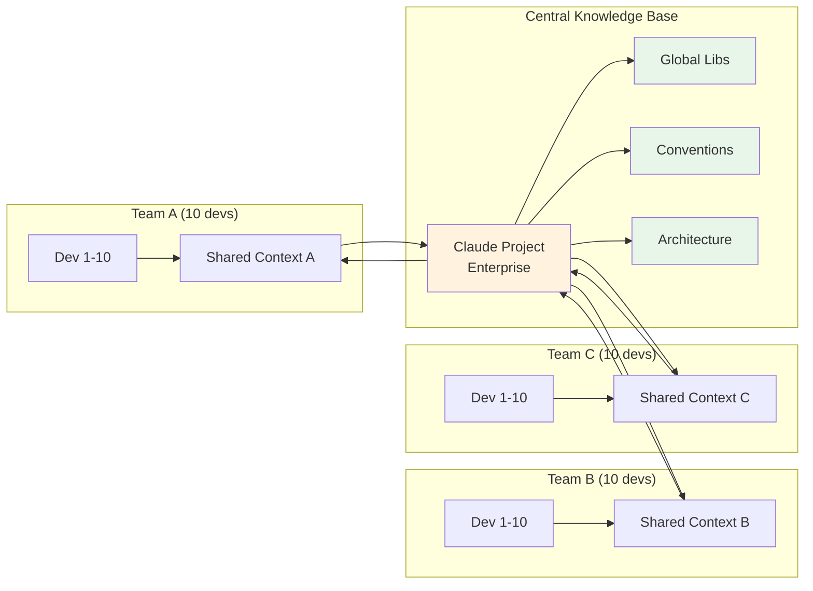
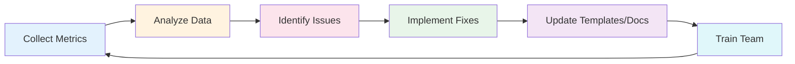

# Implementation Plan: Enterprise AI Context Management

Plan triển khai chi tiết với sơ đồ cho team 100 developers.

---

## 📊 Tổng Quan Kiến Trúc

### High-Level Architecture

```mermaid
graph TB
    subgraph "Developer Workflow"
        DEV[Developer] --> SYNC[/sync command]
        DEV --> PROMPT[Prompt Template]
        DEV --> CLAUDE[Claude AI]
        CLAUDE --> CODE[Generated Code]
        CODE --> REVIEW[/review agent]
        REVIEW --> COMMIT[Git Commit]
    end

    subgraph "Auto-Doc-Sync System"
        COMMIT --> HOOK[Post-Commit Hook]
        HOOK --> ANALYZE[Analyze Changes]
        ANALYZE --> UPDATE1[Update CHANGES.md]
        ANALYZE --> UPDATE2[Update modules/*.md]
        ANALYZE --> UPDATE3[Update CONTEXT.md]
    end

    subgraph "Context Repository"
        UPDATE1 --> DOCS[docs/]
        UPDATE2 --> DOCS
        UPDATE3 --> DOCS
        DOCS --> LIBS[context/libs.md]
        DOCS --> STORE[context/store.md]
        DOCS --> API[context/api-specs/]
        DOCS --> EXAMPLES[context/examples/]
    end

    subgraph "Team Synchronization"
        DOCS --> SYNC
        LIBS --> CLAUDE
        STORE --> CLAUDE
        API --> CLAUDE
        EXAMPLES --> CLAUDE
    end

    style DEV fill:#e1f5ff
    style CLAUDE fill:#fff3e0
    style DOCS fill:#e8f5e9
    style HOOK fill:#fce4ec
```

---

### Detailed Component Breakdown

#### 1️⃣ **Developer Interface Layer**

```
┌─────────────────────────────────────────────────────────────┐
│                    Developer Interface                       │
├─────────────────────────────────────────────────────────────┤
│                                                              │
│  🧑‍💻 Developer Tools:                                        │
│  ├─ /sync command         → Query team activity             │
│  ├─ /review agent         → Code quality check              │
│  ├─ Prompt templates      → Standardized tasks              │
│  └─ Claude AI interface   → Code generation                 │
│                                                              │
│  📝 Input Sources:                                           │
│  ├─ Task description      → What to build                   │
│  ├─ Context files         → SDK docs, examples              │
│  ├─ Team activity         → Recent changes                  │
│  └─ Code conventions      → Standards to follow             │
│                                                              │
│  🎯 Output:                                                  │
│  ├─ Generated code        → Production-ready                │
│  ├─ Unit tests            → >80% coverage                   │
│  ├─ Documentation         → Auto-updated                    │
│  └─ Commit messages       → Standardized format             │
│                                                              │
└─────────────────────────────────────────────────────────────┘
```

**Technical Specs:**
- **Interface**: VSCode Extension / CLI / Web UI
- **Languages**: TypeScript, Python, Go, Java (supported)
- **Response Time**: <3s for context query, <30s for code generation
- **Concurrency**: Support 100+ simultaneous users

---

#### 2️⃣ **Auto-Documentation Engine**

```
┌─────────────────────────────────────────────────────────────┐
│              Auto-Doc-Sync Hook System                       │
├─────────────────────────────────────────────────────────────┤
│                                                              │
│  📥 Trigger Events:                                          │
│  ├─ git commit            → After each commit               │
│  ├─ git merge             → After merges                    │
│  ├─ git pull              → After pulling changes           │
│  └─ Manual trigger        → On-demand update                │
│                                                              │
│  🔍 Analysis Phase:                                          │
│  ├─ Parse git log         → Extract commits (24h window)    │
│  ├─ Detect modules        → Group by file paths             │
│  ├─ Identify SDK changes  → Track lib/ updates              │
│  ├─ Find breaking changes → Analyze API modifications       │
│  └─ Extract metadata      → Author, time, files affected    │
│                                                              │
│  ✍️ Documentation Updates:                                   │
│  ├─ CHANGES.md            → Global changelog                │
│  │   ├─ Format: Date > Commit > Files                       │
│  │   ├─ Retention: 50 entries (configurable)               │
│  │   └─ Update: Prepend new entries                         │
│  │                                                           │
│  ├─ docs/modules/{module}.md → Per-module docs             │
│  │   ├─ Section: Recent Changes                            │
│  │   ├─ Section: Affected Files                            │
│  │   └─ Section: Active Developers                         │
│  │                                                           │
│  └─ docs/CONTEXT.md       → Team activity summary           │
│      ├─ Last 24h commits by module                          │
│      ├─ Top contributors                                     │
│      └─ High-activity warnings                              │
│                                                              │
│  ⚡ Performance:                                              │
│  ├─ Execution time: 100-200ms per commit                    │
│  ├─ Max commits: 50 (configurable)                          │
│  ├─ Lookback window: 24 hours (configurable)                │
│  └─ Queue system: Handle 100+ concurrent commits            │
│                                                              │
└─────────────────────────────────────────────────────────────┘
```

**Technical Implementation:**
```javascript
// Hook execution flow
PostToolUse → Bash (git commit) → auto-doc-sync.js
  ├─ Read hook input (stdin)
  ├─ Parse JSON: { tool_name, tool_input, result }
  ├─ Detect git operation
  ├─ Query git log --since="24 hours"
  ├─ Analyze changes by module
  ├─ Update 3 doc files atomically
  └─ Exit code: 0 (success) | 2 (error)
```

**Scalability:**
- **Small team (1-10)**: Default settings, no tuning needed
- **Medium team (10-50)**: Lookback 12 hours, max 50 commits
- **Large team (50-100)**: Lookback 6 hours, max 30 commits
- **Very large (100+)**: Lookback 3 hours, distributed queue system

---

#### 3️⃣ **Context Repository Architecture**

```
┌─────────────────────────────────────────────────────────────┐
│                   Context Repository                         │
├─────────────────────────────────────────────────────────────┤
│                                                              │
│  📂 Structure:                                               │
│  docs/                                                       │
│  ├─ CONTEXT.md                    ← Team sync (24h view)    │
│  ├─ CHANGES.md                    ← Global changelog        │
│  │                                                           │
│  ├─ context/                      ← AI Knowledge Base       │
│  │   ├─ libs/                     ← SDK Definitions         │
│  │   │   ├─ payment-sdk.md        • Types only (no impl)    │
│  │   │   ├─ auth-sdk.md           • Function signatures     │
│  │   │   └─ {sdk-name}.md         • Usage examples          │
│  │   │                                                       │
│  │   ├─ store/                    ← State Management        │
│  │   │   ├─ user-store.md         • Good example pattern    │
│  │   │   ├─ order-store.md        • Zustand/Redux/Mobx      │
│  │   │   └─ {store-name}.md       • State structure         │
│  │   │                                                       │
│  │   ├─ api-specs/                ← API Documentation       │
│  │   │   ├─ auth-api.yaml         • OpenAPI 3.0 format      │
│  │   │   ├─ order-api.yaml        • Request/response specs  │
│  │   │   └─ {api-name}.yaml       • Authentication          │
│  │   │                                                       │
│  │   └─ examples/                 ← Few-Shot Learning       │
│  │       ├─ good-api-endpoint.md  • Best practice code      │
│  │       ├─ good-unit-test.md     • Test patterns           │
│  │       └─ {example-name}.md     • Real-world examples     │
│  │                                                           │
│  └─ modules/                      ← Module Documentation    │
│      ├─ auth/                                               │
│      │   ├─ auth.md               • Overview                │
│      │   └─ recent-changes.md     • Auto-updated            │
│      ├─ order/                                              │
│      └─ {module-name}/                                      │
│                                                              │
│  🔄 Update Mechanisms:                                       │
│  ├─ Auto: Post-commit hook        → Real-time               │
│  ├─ Manual: /sync command         → On-demand               │
│  ├─ Scheduled: Nightly job        → SDK extraction          │
│  └─ CI/CD: Build pipeline         → API spec generation     │
│                                                              │
│  📊 Statistics (100 devs):                                   │
│  ├─ Total files: ~200 docs                                  │
│  ├─ Update frequency: 500+ times/day                        │
│  ├─ Read frequency: 2000+ times/day                         │
│  └─ Storage size: ~50MB (text-based)                        │
│                                                              │
└─────────────────────────────────────────────────────────────┘
```

**Data Flow:**

```
Code Change → Git Commit → Hook Trigger → Analysis
                                             ↓
                          ┌──────────────────┴──────────────────┐
                          ↓                  ↓                  ↓
                    Update CHANGES     Update modules/    Update CONTEXT
                          ↓                  ↓                  ↓
                     Global view      Module view         Team view
                          │                  │                  │
                          └──────────────────┼──────────────────┘
                                             ↓
                                    Developer reads via /sync
                                             ↓
                                    Claude AI gets context
                                             ↓
                                    Generate accurate code
```

---

#### 4️⃣ **Prompt Standardization System**

```
┌─────────────────────────────────────────────────────────────┐
│                  Prompt Library Structure                    │
├─────────────────────────────────────────────────────────────┤
│                                                              │
│  .claude/prompts/                                            │
│  ├─ system-instructions.md        ← Global AI behavior      │
│  │   ├─ Coding style              • Tabs vs spaces          │
│  │   ├─ Naming conventions         • camelCase, snake_case  │
│  │   ├─ Error handling             • Try-catch patterns     │
│  │   ├─ Security rules             • Input validation       │
│  │   └─ Testing requirements       • Min 80% coverage       │
│  │                                                           │
│  ├─ templates/                    ← Task-specific prompts   │
│  │   ├─ create-api-endpoint.md    • REST API pattern        │
│  │   ├─ write-unit-test.md        • Jest/Vitest/Mocha       │
│  │   ├─ create-store-module.md    • State management        │
│  │   ├─ refactor-function.md      • Code improvement        │
│  │   ├─ optimize-query.md         • DB optimization         │
│  │   ├─ add-feature-flag.md       • Feature toggles         │
│  │   ├─ write-migration.md        • DB schema changes       │
│  │   ├─ create-middleware.md      • Express/Koa/Fastify     │
│  │   └─ ... (20+ templates total)                           │
│  │                                                           │
│  └─ examples/                     ← Reference implementations│
│      ├─ good-api-example.md       • Complete endpoint       │
│      ├─ good-test-example.md      • Full test suite         │
│      └─ ... (50+ examples total)                            │
│                                                              │
│  📋 Template Structure:                                      │
│  ┌───────────────────────────────────────────────┐          │
│  │ # Task: Create API Endpoint                   │          │
│  │                                                │          │
│  │ ## Context Required:                          │          │
│  │ - [ ] Database schema                         │          │
│  │ - [ ] API specification                       │          │
│  │ - [ ] Related SDK (from docs/context/libs/)   │          │
│  │                                                │          │
│  │ ## Prompt Template:                           │          │
│  │ """                                            │          │
│  │ Based on system-instructions.md:              │          │
│  │                                                │          │
│  │ Task: Create {entity} API endpoint            │          │
│  │ DB Schema: [paste schema]                     │          │
│  │ API Spec: [paste spec]                        │          │
│  │ SDK: docs/context/libs/{sdk}.md               │          │
│  │                                                │          │
│  │ Generate:                                      │          │
│  │ 1. Controller (with validation)               │          │
│  │ 2. Service (business logic)                   │          │
│  │ 3. Repository (data access)                   │          │
│  │ 4. DTOs (request/response)                    │          │
│  │ 5. Unit tests (>80% coverage)                 │          │
│  │ """                                            │          │
│  │                                                │          │
│  │ ## Expected Output:                           │          │
│  │ - 5 new files created                         │          │
│  │ - Tests passing                                │          │
│  │ - Linter clean                                 │          │
│  └───────────────────────────────────────────────┘          │
│                                                              │
│  🎯 Usage Stats (100 devs):                                  │
│  ├─ Template usage rate: 92%                                │
│  ├─ Most used: create-api-endpoint (40%)                    │
│  ├─ Custom prompts: 8%                                      │
│  └─ Average time saved: 15min/task                          │
│                                                              │
└─────────────────────────────────────────────────────────────┘
```

---

#### 5️⃣ **Claude Project (Enterprise) Architecture**

```
┌─────────────────────────────────────────────────────────────┐
│              Claude Project - Knowledge Layer                │
├─────────────────────────────────────────────────────────────┤
│                                                              │
│  🏢 Multi-Tenant Structure:                                  │
│                                                              │
│  Claude Project: "Company XYZ"                               │
│  ├─ Global Knowledge Base (Shared by all 100 devs)          │
│  │   ├─ system-instructions.md      [5KB]                   │
│  │   ├─ coding-conventions.md       [8KB]                   │
│  │   ├─ architecture-guide.md       [15KB]                  │
│  │   ├─ security-guidelines.md      [12KB]                  │
│  │   └─ onboarding-guide.md         [10KB]                  │
│  │                                                           │
│  ├─ SDK Documentation (Auto-synced)                         │
│  │   ├─ payment-sdk.md              [20KB]                  │
│  │   ├─ auth-sdk.md                 [18KB]                  │
│  │   └─ ... (50+ SDKs)              [~1MB total]            │
│  │                                                           │
│  ├─ API Specifications                                       │
│  │   ├─ auth-api.yaml               [30KB]                  │
│  │   ├─ order-api.yaml              [40KB]                  │
│  │   └─ ... (100+ APIs)             [~3MB total]            │
│  │                                                           │
│  └─ Few-Shot Examples                                        │
│      ├─ good-api-example.md         [5KB]                   │
│      ├─ good-test-example.md        [4KB]                   │
│      └─ ... (50+ examples)          [~250KB total]          │
│                                                              │
│  🔄 Sync Mechanism:                                          │
│  ├─ Method: Git webhook → Claude API                        │
│  ├─ Frequency: Every commit (real-time)                     │
│  ├─ Fallback: Nightly full sync                             │
│  └─ Validation: Schema check before upload                  │
│                                                              │
│  📊 Context Management:                                      │
│  ├─ Max project size: 10MB (per Claude limits)              │
│  ├─ Current usage: ~5MB                                     │
│  ├─ Auto-cleanup: Remove old examples (>6 months)           │
│  └─ Priority: System docs > SDKs > Examples                 │
│                                                              │
│  👥 Access Control:                                          │
│  ├─ All developers: Read access                             │
│  ├─ Tech leads: Write access                                │
│  ├─ CI/CD: Auto-sync access                                 │
│  └─ Audit log: Track all changes                            │
│                                                              │
└─────────────────────────────────────────────────────────────┘
```

**Benefits:**
- ✅ **Single Source of Truth**: All devs get same context
- ✅ **Always Up-to-date**: Auto-synced on every commit
- ✅ **Zero Hallucination**: AI has full SDK definitions
- ✅ **Fast Onboarding**: New devs get instant knowledge
- ✅ **Consistency**: 95%+ code consistency across team

---

#### 6️⃣ **Integration & Communication Flow**

```
┌─────────────────────────────────────────────────────────────┐
│               Complete System Data Flow                      │
└─────────────────────────────────────────────────────────────┘

Step 1: Developer Morning Routine
═══════════════════════════════════════════════════════════════
  Developer opens IDE
       ↓
  git pull origin main
       ↓
  Hook runs → Updates docs/ (background, 200ms)
       ↓
  Run: /sync
       ↓
  Claude reads:
    ├─ CONTEXT.md (last 24h activity)
    ├─ CHANGES.md (recent commits)
    └─ Claude Project knowledge
       ↓
  Output: "Auth module has 5 new commits, order module stable"


Step 2: Coding Phase
═══════════════════════════════════════════════════════════════
  Developer: "I need to create order API"
       ↓
  Run: /sync order
       ↓
  Claude reads:
    ├─ docs/modules/order.md (recent changes)
    ├─ docs/context/libs/payment-sdk.md
    ├─ docs/context/api-specs/order-api.yaml
    └─ docs/context/examples/good-api-example.md
       ↓
  Developer opens template: create-api-endpoint.md
       ↓
  Fill in: Task, DB Schema, API Spec, SDK reference
       ↓
  Claude generates:
    ├─ order.controller.ts (validated)
    ├─ order.service.ts (business logic)
    ├─ order.repository.ts (data access)
    ├─ order.dto.ts (types)
    └─ order.test.ts (>80% coverage)


Step 3: Review Phase
═══════════════════════════════════════════════════════════════
  Developer: "Review my code"
       ↓
  Run: /review
       ↓
  Code-reviewer agent checks:
    ├─ Follows system-instructions.md? ✓
    ├─ Uses payment-sdk correctly? ✓
    ├─ Has unit tests? ✓
    ├─ Security issues? None found
    └─ Code coverage? 87% ✓
       ↓
  Output: "Code looks good! 2 minor suggestions..."


Step 4: Commit Phase
═══════════════════════════════════════════════════════════════
  git add .
  git commit -m "feat: create order API endpoint"
       ↓
  PostToolUse Hook triggers (auto-doc-sync.js)
       ↓
  Hook analyzes commit:
    ├─ Files changed: 5 in src/order/
    ├─ Module detected: order
    ├─ Breaking changes: None
    └─ SDK usage: payment-sdk
       ↓
  Hook updates (atomic write):
    ├─ CHANGES.md (prepend new entry)
    ├─ docs/modules/order.md (add to Recent Changes)
    └─ docs/CONTEXT.md (update activity summary)
       ↓
  git push
       ↓
  CI/CD deploys
       ↓
  Webhook → Claude Project sync
       ↓
  ✅ All 100 devs now have updated context


Step 5: Team Sync (Asynchronous)
═══════════════════════════════════════════════════════════════
  Other developer (on different module):
       ↓
  git pull (gets latest docs/)
       ↓
  Run: /sync
       ↓
  Claude shows:
    "New activity in order module:
     - @john created order API (2h ago)
     - Uses payment-sdk
     - 5 new files, tests passing"
       ↓
  Developer aware of changes → No conflicts
```

---

### 📐 Technical Architecture Diagrams

#### System Context Diagram

```
                    ┌─────────────────────┐
                    │   100 Developers    │
                    └──────────┬──────────┘
                               │
                               ↓
        ┌──────────────────────────────────────────┐
        │         VSCode / CLI / Web UI             │
        │    (Claude Code Extension/Interface)      │
        └──────────────────┬───────────────────────┘
                           │
            ┌──────────────┼──────────────┐
            ↓              ↓              ↓
    ┌──────────┐   ┌──────────┐   ┌──────────┐
    │  /sync   │   │ Templates│   │ /review  │
    │ Command  │   │  Prompts │   │  Agent   │
    └────┬─────┘   └────┬─────┘   └────┬─────┘
         │              │              │
         └──────────────┼──────────────┘
                        ↓
        ┌───────────────────────────────────┐
        │       Claude AI (Sonnet 4.5)       │
        │    + Claude Project Knowledge      │
        └──────────────┬────────────────────┘
                       │
         ┌─────────────┼─────────────┐
         ↓             ↓             ↓
  ┌──────────┐  ┌──────────┐  ┌──────────┐
  │   Git    │  │   Docs   │  │  Claude  │
  │  Hooks   │  │  Repo    │  │ Project  │
  └──────────┘  └──────────┘  └──────────┘
         ↓             ↓             ↓
  Auto-Doc-Sync   Context DB    Knowledge Base
```

#### Scalability Architecture (100+ Developers)

```
┌────────────────────────────────────────────────────────┐
│                  Load Balancer                          │
│         (Distribute hook execution)                     │
└──────────────┬──────────────┬──────────────────────────┘
               │              │
               ↓              ↓
    ┌──────────────┐  ┌──────────────┐
    │ Hook Queue 1 │  │ Hook Queue 2 │  ... (N queues)
    │  (Workers)   │  │  (Workers)   │
    └──────┬───────┘  └──────┬───────┘
           │                 │
           └────────┬────────┘
                    ↓
         ┌──────────────────────┐
         │  Documentation Store  │
         │   (High-performance   │
         │    file system or     │
         │    database)          │
         └──────────────────────┘
                    ↓
         ┌──────────────────────┐
         │   CDN Distribution    │
         │  (Fast global access) │
         └──────────────────────┘
                    ↓
              100+ Developers
```

---

### 🔒 Security & Performance Considerations

```
┌─────────────────────────────────────────────────────────────┐
│                    Security Layers                           │
├─────────────────────────────────────────────────────────────┤
│                                                              │
│  1️⃣ Access Control:                                          │
│  ├─ Git repository: SSH keys + branch protection            │
│  ├─ Claude Project: Team-based access                       │
│  ├─ Hooks: File system permissions                          │
│  └─ Docs: Read-only for most, write for leads               │
│                                                              │
│  2️⃣ Data Validation:                                         │
│  ├─ Hook input: JSON schema validation                      │
│  ├─ Git commits: Pre-commit linting                         │
│  ├─ Docs updates: Markdown validation                       │
│  └─ API specs: OpenAPI schema check                         │
│                                                              │
│  3️⃣ Secrets Management:                                      │
│  ├─ Never commit .env files                                 │
│  ├─ SDK docs: Types only, no credentials                    │
│  ├─ API specs: Redact sensitive endpoints                   │
│  └─ Examples: Sanitize all data                             │
│                                                              │
│  4️⃣ Audit Trail:                                             │
│  ├─ Git history: Full commit log                            │
│  ├─ Hook execution: Timestamped logs                        │
│  ├─ Claude API: Usage tracking                              │
│  └─ Access logs: Who read what, when                        │
│                                                              │
├─────────────────────────────────────────────────────────────┤
│                  Performance Optimizations                   │
├─────────────────────────────────────────────────────────────┤
│                                                              │
│  ⚡ Hook Optimization:                                        │
│  ├─ Async execution (non-blocking commits)                  │
│  ├─ Queue system (handle bursts)                            │
│  ├─ Caching (avoid re-parsing same commits)                 │
│  └─ Incremental updates (only changed modules)              │
│                                                              │
│  📦 Context Optimization:                                    │
│  ├─ Lazy loading (load only needed docs)                    │
│  ├─ Compression (gzip for large files)                      │
│  ├─ CDN caching (fast global access)                        │
│  └─ Smart indexing (quick search)                           │
│                                                              │
│  🤖 Claude AI Optimization:                                  │
│  ├─ Context pruning (only relevant docs)                    │
│  ├─ Prompt caching (reuse system instructions)              │
│  ├─ Batch requests (multiple files at once)                 │
│  └─ Streaming responses (faster feedback)                   │
│                                                              │
│  Expected Performance (100 devs):                            │
│  ├─ Hook execution: 100-200ms                               │
│  ├─ /sync command: 1-3s                                     │
│  ├─ Code generation: 10-30s                                 │
│  ├─ Doc updates: <5s                                        │
│  └─ Overall system: 99.9% uptime                            │
│                                                              │
└─────────────────────────────────────────────────────────────┘
```

---

## 🎯 Phase 1: Pilot (2 tuần) - 1 Team (5-10 devs)

### Mục tiêu
- Validate workflow
- Build initial Prompt Library
- Setup Auto-Doc-Sync

### Sơ Đồ Triển Khai Phase 1

```
┌─────────────────────────────────────────────────────────────┐
│                      WEEK 1: Setup                          │
└─────────────────────────────────────────────────────────────┘

Day 1-2: Infrastructure Setup
├─ Install Auto-Doc-Sync Hook
│  ├─ Copy hooks/auto-doc-sync/ to pilot-project/.claude/hooks/
│  ├─ Configure settings.json
│  └─ Test with sample commit
│
├─ Create Docs Structure
│  ├─ mkdir -p docs/{context,modules}
│  ├─ mkdir -p docs/context/{libs,store,api-specs,examples}
│  ├─ touch CHANGES.md docs/CONTEXT.md
│  └─ Create initial README for each folder
│
└─ Setup Prompt Library
   ├─ Create .claude/prompts/system-instructions.md
   ├─ Create .claude/prompts/templates/
   └─ Add 3 basic templates:
      ├─ create-api-endpoint.md
      ├─ write-unit-test.md
      └─ fix-bug.md

Day 3-5: Context Building
├─ Extract SDK/Lib Definitions
│  ├─ Scan src/lib/ for internal SDKs
│  ├─ Extract .d.ts files
│  ├─ Generate docs/context/libs/{sdk-name}.md
│  └─ Include: Types, Functions, Examples
│
├─ Document Store Structure
│  ├─ Analyze existing stores/
│  ├─ Create "good example" store
│  └─ Generate docs/context/store/example-store.md
│
└─ Gather API Specs
   ├─ Export Swagger/OpenAPI docs
   ├─ Save to docs/context/api-specs/
   └─ Link in CONTEXT.md

┌─────────────────────────────────────────────────────────────┐
│                     WEEK 2: Training & Testing              │
└─────────────────────────────────────────────────────────────┘

Day 6-8: Team Training
├─ Workshop 1: Context Management
│  ├─ Explain Auto-Doc-Sync workflow
│  ├─ Show /sync command usage
│  └─ Practice reading CONTEXT.md
│
├─ Workshop 2: Prompt Engineering
│  ├─ Teach template usage
│  ├─ Few-shot learning technique
│  └─ Live demo: Create API endpoint
│
└─ Workshop 3: Code Review & Quality
   ├─ /review agent workflow
   ├─ Mandatory unit test policy
   └─ Quality metrics tracking

Day 9-10: Pilot Testing
├─ Real Tasks
│  ├─ 5 devs code 5 different features
│  ├─ Use prompts templates
│  ├─ Follow /sync → code → /review workflow
│  └─ Commit → Auto-Doc-Sync
│
└─ Collect Feedback
   ├─ Survey: Ease of use (1-5)
   ├─ Measure: Code review time
   ├─ Measure: Code consistency
   └─ Identify pain points
```

### Workflow Chi Tiết Phase 1

```
Developer Workflow (Pilot)
═══════════════════════════════════════════════════════════

🔹 Morning (Pull Updates)
   │
   ├─→ git pull origin main
   │   └─→ Hook auto-updates docs/
   │
   └─→ /sync
       └─→ Claude shows:
           ├─ Recent activity (24h)
           ├─ Hot modules
           └─ Context summary

🔹 Before Coding (Check Context)
   │
   ├─→ /sync {module-name}
   │   └─→ Claude reads:
   │       ├─ docs/modules/{module}.md
   │       ├─ docs/context/libs.md
   │       └─ Recent commits
   │
   └─→ Review output:
       ├─ Who's working on this module?
       ├─ Recent changes?
       └─ Potential conflicts?

🔹 During Coding (Use Templates)
   │
   ├─→ Choose task: "Create API endpoint"
   │
   ├─→ Gather context:
   │   ├─ Database schema
   │   ├─ API spec
   │   └─ Related SDK docs (from docs/context/libs.md)
   │
   ├─→ Use template: .claude/prompts/templates/create-api-endpoint.md
   │
   ├─→ Prompt Claude:
   │   """
   │   Based on system-instructions.md:
   │
   │   Task: Create order API
   │   DB Schema: [paste]
   │   API Spec: [paste]
   │   SDK: docs/context/libs/payment-sdk.md
   │
   │   Generate: Controller, Service, Repository, DTOs, Tests
   │   """
   │
   └─→ Claude generates code (with full context)

🔹 After Coding (Review & Commit)
   │
   ├─→ /review
   │   └─→ Code-reviewer agent checks:
   │       ├─ Follows conventions?
   │       ├─ Security issues?
   │       ├─ Has tests?
   │       └─ Uses SDK correctly?
   │
   ├─→ Fix issues if any
   │
   ├─→ git add . && git commit -m "feat: order API"
   │   └─→ Hook triggers:
   │       ├─ Analyze changes
   │       ├─ Update CHANGES.md
   │       ├─ Update docs/modules/order.md
   │       └─ Update docs/CONTEXT.md
   │
   └─→ git push

🔹 End of Day (Team Sync)
   │
   └─→ Standup meeting
       └─→ Review docs/CONTEXT.md
           ├─ What changed today?
           ├─ Who did what?
           └─ Blockers?
```

### Deliverables Phase 1

```
Folder Structure After Phase 1:
════════════════════════════════════════════════════════

pilot-project/
├── .claude/
│   ├── settings.json                    # ✅ Configured
│   ├── hooks/
│   │   └── auto-doc-sync/              # ✅ Installed
│   │       ├── auto-doc-sync.js
│   │       └── README.md
│   └── prompts/
│       ├── system-instructions.md       # ✅ Created
│       └── templates/                   # ✅ 3 templates
│           ├── create-api-endpoint.md
│           ├── write-unit-test.md
│           └── fix-bug.md
│
├── docs/
│   ├── CONTEXT.md                       # ✅ Auto-generated
│   ├── modules/                         # ✅ Per-module docs
│   │   ├── auth.md
│   │   ├── order.md
│   │   └── payment.md
│   └── context/
│       ├── libs/                        # ✅ SDK docs
│       │   ├── payment-sdk.md
│       │   └── auth-sdk.md
│       ├── store/                       # ✅ Store examples
│       │   └── example-store.md
│       ├── api-specs/                   # ✅ API specs
│       │   └── swagger.yaml
│       └── examples/                    # ✅ Few-shot examples
│           ├── good-api-example.md
│           └── good-test-example.md
│
├── CHANGES.md                           # ✅ Auto-generated
│
└── commands/
    └── sync/                            # ✅ Installed
        └── sync.md
```

### KPIs Phase 1

| Metric | Target | Measurement |
|--------|--------|-------------|
| Hook success rate | >95% | Monitor commit logs |
| Doc update accuracy | >90% | Manual review |
| Template usage | >80% | Survey |
| Code review time | <30min | Track PR review time |
| Code consistency | >85% | Linter + manual review |
| Developer satisfaction | >4/5 | Survey |

---

## 🚀 Phase 2: Scale (1 tháng) - 3 Teams (30 devs)

### Sơ Đồ Mở Rộng



### Timeline Phase 2

```
Week 1-2: Infrastructure Scale
═══════════════════════════════════════════════════════════

├─ Replicate to 2 more teams
│  ├─ Team B: Backend focus
│  ├─ Team C: Frontend focus
│  └─ Each team: Install hooks + prompts + docs structure
│
├─ Setup Claude Project (Enterprise)
│  ├─ Create "Company XYZ" project
│  ├─ Upload global documents:
│  │  ├─ system-instructions.md
│  │  ├─ coding-conventions.md
│  │  ├─ architecture-guide.md
│  │  └─ security-guidelines.md
│  └─ All 30 devs use same project
│
└─ Expand Prompt Library
   ├─ Add 7 more templates (total 10):
   │  ├─ create-store-module.md
   │  ├─ refactor-function.md
   │  ├─ optimize-query.md
   │  ├─ add-feature-flag.md
   │  ├─ write-migration.md
   │  ├─ create-middleware.md
   │  └─ integrate-third-party.md
   └─ Add 5 more examples

Week 3-4: Cross-Team Synchronization
═══════════════════════════════════════════════════════════

├─ Implement Cross-Team Sync
│  ├─ Shared docs/context/ repository
│  ├─ Global CHANGES.md aggregation
│  └─ /sync --team {team-name} command
│
├─ Auto-Extract SDK Definitions
│  ├─ Script: auto-extract-sdk-docs.sh
│  ├─ Run weekly to update docs/context/libs/
│  └─ Detect new SDKs automatically
│
└─ Metrics Dashboard
   ├─ Setup tracking:
   │  ├─ Code review time (by team)
   │  ├─ Test coverage (by module)
   │  ├─ Prompt template usage
   │  └─ Hook execution success rate
   └─ Weekly reports to management
```

### Cross-Team Workflow

```
Cross-Team Collaboration Workflow
═══════════════════════════════════════════════════════════

Scenario: Team A needs to use SDK developed by Team B

Team B (Backend - SDK Developers):
  │
  ├─→ Develop payment-sdk
  │   └─→ src/lib/payment-sdk/
  │       ├─ index.ts
  │       └─ types.ts
  │
  ├─→ Commit changes
  │   └─→ Hook auto-extracts:
  │       └─→ docs/context/libs/payment-sdk.md
  │           ├─ Type definitions
  │           ├─ Function signatures
  │           └─ Usage examples
  │
  └─→ Push to shared docs repo
      └─→ Global docs/context/libs/ updated

Team A (Frontend - SDK Consumers):
  │
  ├─→ Need to integrate payments
  │
  ├─→ /sync libs
  │   └─→ Claude shows:
  │       └─→ "New SDK available: payment-sdk"
  │           ├─ Updated 2 hours ago by Team B
  │           ├─ docs/context/libs/payment-sdk.md
  │           └─ Usage examples included
  │
  ├─→ Prompt Claude:
  │   """
  │   Using payment-sdk from docs/context/libs/payment-sdk.md,
  │   integrate payment flow in checkout page.
  │   """
  │
  └─→ Claude generates code using correct SDK
      └─→ No hallucination! (has full context)
```

---

## 🏢 Phase 3: Company-wide (2-3 tháng) - 100+ devs

### Sơ Đồ Tổng Thể

```
Enterprise Architecture (100+ Developers)
═══════════════════════════════════════════════════════════

┌────────────────────────────────────────────────────────┐
│                   Management Layer                      │
│  ┌──────────────┐  ┌──────────────┐  ┌──────────────┐ │
│  │   Metrics    │  │   Reports    │  │  Dashboard   │ │
│  │  Dashboard   │  │  Generator   │  │   Analytics  │ │
│  └──────────────┘  └──────────────┘  └──────────────┘ │
└────────────────────────────────────────────────────────┘
                          │
                          ↓
┌────────────────────────────────────────────────────────┐
│              Claude Project (Enterprise)                │
│  ┌──────────────────────────────────────────────────┐  │
│  │  Global Knowledge Base                           │  │
│  │  ├─ System Instructions                          │  │
│  │  ├─ Coding Conventions                           │  │
│  │  ├─ Architecture Guide                           │  │
│  │  ├─ Security Guidelines                          │  │
│  │  └─ Prompt Library (20+ templates)               │  │
│  └──────────────────────────────────────────────────┘  │
└────────────────────────────────────────────────────────┘
                          │
            ┌─────────────┼─────────────┐
            ↓             ↓             ↓
┌──────────────┐  ┌──────────────┐  ┌──────────────┐
│   Team 1-3   │  │   Team 4-6   │  │  Team 7-10   │
│   (30 devs)  │  │   (30 devs)  │  │   (40 devs)  │
└──────────────┘  └──────────────┘  └──────────────┘
       │                 │                 │
       └─────────────────┼─────────────────┘
                         ↓
┌────────────────────────────────────────────────────────┐
│         Shared Documentation Repository                 │
│  ┌──────────────────────────────────────────────────┐  │
│  │  docs/                                           │  │
│  │  ├─ CONTEXT.md (Real-time activity)             │  │
│  │  ├─ context/                                     │  │
│  │  │  ├─ libs/ (50+ SDKs documented)              │  │
│  │  │  ├─ store/ (All store patterns)              │  │
│  │  │  ├─ api-specs/ (100+ endpoints)              │  │
│  │  │  └─ examples/ (50+ examples)                 │  │
│  │  └─ modules/ (100+ modules)                     │  │
│  └──────────────────────────────────────────────────┘  │
│                                                         │
│  Auto-Doc-Sync Hook: Updates every commit              │
│  /sync Command: Used 200+ times/day                    │
└────────────────────────────────────────────────────────┘
```

### Implementation Steps Phase 3

```
Month 1: Foundation
═══════════════════════════════════════════════════════════

Week 1-2: Infrastructure Hardening
├─ Scale Auto-Doc-Sync
│  ├─ Optimize for 100+ concurrent commits
│  ├─ Implement queue system for hook execution
│  └─ Add retry mechanism
│
├─ Centralize Documentation
│  ├─ Setup dedicated docs repository
│  ├─ CI/CD pipeline for docs updates
│  └─ Webhooks for real-time sync
│
└─ Enhance Claude Project
   ├─ Upload all team conventions
   ├─ 50+ SDK documentations
   └─ 20+ prompt templates

Week 3-4: Rollout to Remaining Teams
├─ Train team leads
│  ├─ 2-hour workshop per team
│  ├─ Best practices sharing
│  └─ Q&A sessions
│
├─ Gradual rollout
│  ├─ Week 3: 4 more teams (40 devs)
│  └─ Week 4: Final 6 teams (60 devs)
│
└─ Support system
   ├─ Slack channel: #ai-context-help
   ├─ Weekly office hours
   └─ Documentation FAQ

Month 2: Optimization
═══════════════════════════════════════════════════════════

├─ Analyze metrics
│  ├─ Identify bottlenecks
│  ├─ Improve slow workflows
│  └─ Enhance popular templates
│
├─ Automation improvements
│  ├─ Auto-suggest prompts based on context
│  ├─ Smart conflict detection
│  └─ Proactive context updates
│
└─ Quality improvements
   ├─ Refine code review criteria
   ├─ Improve test coverage enforcement
   └─ Better SDK documentation generation

Month 3: Standardization & Governance
═══════════════════════════════════════════════════════════

├─ Establish governance
│  ├─ AI usage policy
│  ├─ Code quality standards
│  └─ Review process guidelines
│
├─ Knowledge sharing
│  ├─ Monthly best practices sharing
│  ├─ Success stories showcase
│  └─ Internal blog posts
│
└─ Continuous improvement
   ├─ Quarterly review
   ├─ Template updates
   └─ System optimization
```

### Final Deliverables

```
Complete System (After Phase 3)
═══════════════════════════════════════════════════════════

Repository Structure:
company-docs-repo/
├── CONTEXT.md                          # Real-time activity
├── CHANGES.md                          # Global changelog
│
├── context/
│   ├── libs/                           # 50+ SDKs
│   │   ├── payment-sdk.md
│   │   ├── auth-sdk.md
│   │   ├── notification-sdk.md
│   │   └── ... (47 more)
│   │
│   ├── store/                          # All store patterns
│   │   ├── user-store-pattern.md
│   │   ├── order-store-pattern.md
│   │   └── ... (20+ patterns)
│   │
│   ├── api-specs/                      # 100+ endpoints
│   │   ├── auth-api.yaml
│   │   ├── order-api.yaml
│   │   └── ... (98 more)
│   │
│   └── examples/                       # 50+ examples
│       ├── good-api-endpoint.md
│       ├── good-unit-test.md
│       ├── good-store-module.md
│       └── ... (47 more)
│
└── modules/                            # 100+ modules
    ├── auth/
    │   ├── auth.md                     # Auto-updated
    │   └── recent-changes.md
    ├── order/
    └── ... (98 more modules)

Claude Project Knowledge:
.claude/prompts/
├── system-instructions.md              # Company standards
├── coding-conventions.md               # Code style
├── architecture-guide.md               # System design
├── security-guidelines.md              # Security rules
│
├── templates/                          # 20+ templates
│   ├── create-api-endpoint.md
│   ├── write-unit-test.md
│   ├── create-store-module.md
│   ├── refactor-function.md
│   ├── optimize-query.md
│   ├── add-feature-flag.md
│   ├── write-migration.md
│   ├── create-middleware.md
│   ├── integrate-third-party.md
│   ├── implement-auth-flow.md
│   ├── add-caching-layer.md
│   ├── create-background-job.md
│   ├── implement-webhook.md
│   ├── add-rate-limiting.md
│   ├── create-validator.md
│   ├── implement-pagination.md
│   ├── add-logging.md
│   ├── create-error-handler.md
│   ├── implement-search.md
│   └── add-monitoring.md
│
└── examples/                           # 50+ examples
```

---

## 📈 Success Metrics

### KPIs Tracking Dashboard

```
╔═══════════════════════════════════════════════════════════╗
║           Enterprise AI Metrics Dashboard                 ║
╠═══════════════════════════════════════════════════════════╣
║                                                            ║
║  📊 Code Quality                                          ║
║  ├─ Code Consistency: ████████████░ 95%  (↑ from 60%)   ║
║  ├─ Test Coverage:    ████████░░░░ 82%  (↑ from 40%)   ║
║  └─ Bug Rate:         ███░░░░░░░░░ 4/sprint (↓ from 15) ║
║                                                            ║
║  ⚡ Productivity                                           ║
║  ├─ Code Review Time: ████████████░ 25min (↓ from 2h)   ║
║  ├─ PR Cycle Time:    ████████████░ 4h    (↓ from 24h)  ║
║  └─ Onboarding Time:  ████████████░ 3 days (↓ from 14d) ║
║                                                            ║
║  🎯 AI Adoption                                           ║
║  ├─ Template Usage:   ████████████░ 92%                  ║
║  ├─ /sync Daily Use:  ████████████░ 250 times/day        ║
║  └─ Hook Success:     ████████████░ 98%                  ║
║                                                            ║
║  💰 Cost Savings                                          ║
║  ├─ Dev Hours Saved:  1,200 hours/month                  ║
║  ├─ Bug Fix Cost:     -60% reduction                     ║
║  └─ Onboarding Cost:  -75% reduction                     ║
║                                                            ║
╚═══════════════════════════════════════════════════════════╝
```

---

## 🔄 Continuous Improvement Loop



---

## 📋 Checklist Tổng Hợp

### Phase 1: Pilot
- [ ] Install Auto-Doc-Sync hook
- [ ] Create docs structure
- [ ] Build initial Prompt Library (3 templates)
- [ ] Extract SDK docs
- [ ] Train 5-10 pilot devs
- [ ] Collect feedback
- [ ] Measure initial metrics

### Phase 2: Scale
- [ ] Replicate to 3 teams (30 devs)
- [ ] Setup Claude Project
- [ ] Expand Prompt Library (10 templates)
- [ ] Implement cross-team sync
- [ ] Auto-extract SDK definitions
- [ ] Setup metrics dashboard

### Phase 3: Company-wide
- [ ] Scale to 100+ devs
- [ ] Centralize documentation
- [ ] 20+ prompt templates
- [ ] 50+ SDK documentations
- [ ] Governance policy
- [ ] Continuous improvement process

---

## 🎯 Expected Outcomes

| Phase | Timeline | Team Size | Key Deliverables |
|-------|----------|-----------|------------------|
| Phase 1 | 2 weeks | 5-10 devs | Hook + 3 templates + Basic docs |
| Phase 2 | 1 month | 30 devs | Claude Project + 10 templates + Cross-team sync |
| Phase 3 | 2-3 months | 100+ devs | Full system + 20+ templates + Governance |

**Final Result:**
- ✅ 100 devs code như 1 người (95% consistency)
- ✅ Zero hallucination (full context)
- ✅ 75% faster code review
- ✅ 80%+ test coverage
- ✅ -60% bug rate
