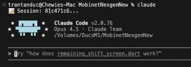
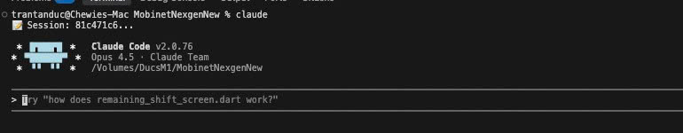

# Claude Code Skills & Agents

Bộ sưu tập skills, agents và cấu hình nâng cao cho Claude Code.




## Giới Thiệu

Repository này cung cấp một hệ thống mở rộng hoàn chỉnh cho Claude Code, bao gồm:

- **Skills** - Hướng dẫn chuyên biệt giúp Claude thực hiện các tác vụ cụ thể tốt hơn
- **Agents** - Các agent được cấu hình sẵn cho từng loại công việc
- **Hooks** - Script tự động chạy trước/sau khi Claude thực thi lệnh
- **Statusline** - Thanh trạng thái tùy chỉnh hiển thị thông tin hữu ích

---

## So Sánh: Có vs Không Tích Hợp

### Ưu Điểm Khi Tích Hợp

| Tính năng | Mô tả |
|-----------|-------|
| **Chuyên môn hóa** | Claude hiểu rõ patterns, best practices của từng framework/ngôn ngữ |
| **Agents chuyên biệt** | 8 agents sẵn sàng cho code review, debug, database, UI/UX... |
| **Bảo vệ hiệu suất** | Hook tự động chặn truy cập `node_modules`, `.git` - tránh lag |
| **Statusline thông minh** | Xem git branch, model, chi phí, tokens ngay trên terminal |
| **Context tốt hơn** | Skills cung cấp context chuyên sâu, giảm hallucination |
| **Workflow nhất quán** | Agents đảm bảo quy trình làm việc chuẩn hóa |

### Nhược Điểm Khi KHÔNG Tích Hợp

| Vấn đề | Hậu quả |
|--------|---------|
| **Thiếu context chuyên sâu** | Claude phải đoán patterns, dễ viết code không theo chuẩn |
| **Không có agents** | Phải hướng dẫn Claude từng bước, mất thời gian |
| **Truy cập thư mục nặng** | Claude có thể scan `node_modules` → chậm, tốn tokens |
| **Không có statusline** | Không biết đang dùng bao nhiêu tokens, chi phí |
| **Debug thủ công** | Không có quy trình debug có hệ thống |
| **Review code thủ công** | Thiếu checklist và tiêu chuẩn review |

---

## Bắt Đầu Nhanh

### Cách 1: Tích Hợp vào Dự Án Có Sẵn

```bash
# Clone repository này
git clone <repo-url> tooltip_claude

# Chạy script tích hợp
./tooltip_claude/integrate.sh /path/to/your-project
```

### Cách 2: Copy Thủ Công

```bash
# Copy skills cần thiết
cp -r tooltip_claude/skills/debugging your-project/.claude/skills/
cp -r tooltip_claude/skills/frontend-development your-project/.claude/skills/

# Copy agents
cp tooltip_claude/agents/*.md your-project/.claude/agents/

# Copy hooks và statusline
cp tooltip_claude/hooks/* your-project/.claude/hooks/
cp tooltip_claude/.claude/statusline.* your-project/.claude/
```

Xem chi tiết tại [INTEGRATION_GUIDE.md](INTEGRATION_GUIDE.md)

> **Gặp vấn đề kết nối?** Xem [NETWORK_GUIDE.md](NETWORK_GUIDE.md) để cấu hình bypass proxy, VPN, SSH tunnel...

---

## Cấu Trúc Repository

```
tooltip_claude/
├── .claude/                # ⚙️ Cấu hình
│   ├── settings.json
│   └── statusline.js
│
├── agents/                 # 🤖 8 Agents (code-reviewer, debugger...)
│   ├── code-reviewer.md
│   ├── debugger.md
│   └── ... (8 agents)
│
├── hooks/                  # 🔗 4 Hooks modular
│   ├── scout-block/        # Chặn thư mục nặng ⭐
│   ├── dev-rules-reminder/ # Nhắc coding rules
│   ├── discord-notify/     # Discord notifications
│   └── telegram-notify/    # Telegram notifications
│
├── commands/               # ⚡ 23 Slash Commands
│   ├── cook/              # /cook - Quick implement
│   ├── fix/               # /fix - Bug fixes
│   ├── plan/              # /plan - Planning
│   ├── design/            # /design - UI/UX
│   └── ... (23 commands)
│
├── skills/                 # 📚 7 Skills + document-skills
│   ├── backend-development/
│   ├── frontend-development/
│   ├── mobile-development/
│   ├── databases/
│   ├── web-frameworks/
│   ├── debugging/
│   ├── research/
│   └── document-skills/    # PDF, DOCX, PPTX, XLSX
│
├── assets/                 # 📸 Screenshots
├── integrate.sh            # 🚀 Script tích hợp tự động
├── README.md               # Tổng quan
├── INTEGRATION_GUIDE.md    # Hướng dẫn tích hợp
└── NETWORK_GUIDE.md        # Cấu hình mạng/proxy
```

**Modular Design:**
- Mỗi hook/command trong folder riêng
- Có README.md riêng
- Download/cài đặt độc lập

---

## Skills

Skills là thư mục chứa file `SKILL.md` hướng dẫn Claude thực hiện tác vụ chuyên biệt.

### Danh Sách Skills

| Loại | Skills | Mô tả |
|------|--------|-------|
| **Documents** | pdf, docx, pptx, xlsx | Xử lý tài liệu Office (built-in) |
| **Development** | backend, frontend, mobile | Node.js, React, Flutter, Swift... |
| **Databases** | databases | MongoDB, PostgreSQL |
| **UI/UX** | web-frameworks | Next.js, Nuxt, Astro |
| **Quality** | debugging | Debug có hệ thống |
| **Meta** | research | Nghiên cứu kỹ thuật |

### Skills Theo Loại Dự Án

| Dự Án | Skills Nên Dùng |
|-------|-----------------|
| **Web Frontend** | `frontend-development`, `web-frameworks` |
| **Backend API** | `backend-development`, `databases` |
| **Mobile App** | `mobile-development` |
| **Full Stack** | `frontend-development`, `backend-development`, `databases` |

---

## Agents

Agents là các "chuyên gia ảo" được cấu hình sẵn cho từng loại công việc.

| Agent | Chức năng |
|-------|-----------|
| **code-reviewer** | Review code, kiểm tra chất lượng, security |
| **debugger** | Debug có hệ thống, phân tích root cause |
| **database-admin** | Tối ưu query, quản lý database |
| **planner** | Lập kế hoạch implementation |
| **project-manager** | Quản lý tiến độ dự án |
| **ui-ux-designer** | Thiết kế UI/UX, wireframes |
| **docs-manager** | Quản lý tài liệu kỹ thuật |
| **researcher** | Nghiên cứu công nghệ mới |

---

## Cấu Hình

### Custom Statusline

Hiển thị: thư mục, git branch, model, thời gian session, chi phí, tokens

```json
{
  "statusLine": {
    "type": "command",
    "command": "node .claude/statusline.js"
  }
}
```

### Scout-Block Hook

Tự động chặn Bash commands truy cập các thư mục nặng:
- `node_modules/` - Hàng nghìn packages
- `__pycache__/` - Python cache
- `.git/` - Git history
- `dist/`, `build/` - Build artifacts

```json
{
  "hooks": {
    "PreToolUse": [
      {
        "matcher": "Bash",
        "hooks": [{
          "type": "command",
          "command": "node \"$CLAUDE_PROJECT_DIR\"/.claude/hooks/scout-block.js"
        }]
      }
    ]
  }
}
```

---

## Tạo Skill Mới

```markdown
---
name: my-skill
description: Mô tả khi nào Claude nên dùng skill này
---

# Tên Skill

Hướng dẫn chi tiết cho Claude...

## Ví dụ
- Ví dụ 1
- Ví dụ 2
```

---

## Tài Liệu Tham Khảo

- [What are skills?](https://support.claude.com/en/articles/12512176-what-are-skills)
- [Using skills in Claude](https://support.claude.com/en/articles/12512180-using-skills-in-claude)
- [Creating custom skills](https://support.claude.com/en/articles/12512198-creating-custom-skills)
- [Skills API Quickstart](https://docs.claude.com/en/api/skills-guide#creating-a-skill)

---

## License

Example skills: Apache 2.0. Document skills: source-available.
