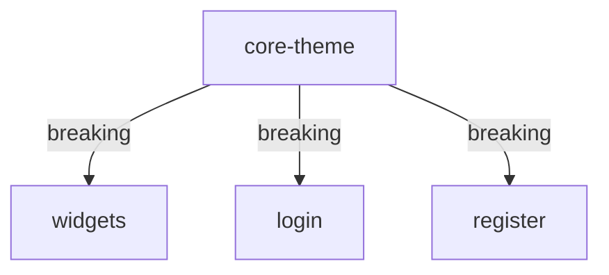

# Multi-Module Detection - Test Case

Test case để kiểm tra khả năng detect và update docs cho multiple modules.

## Test Case 1: Refactor Theme System (4 Modules Affected)

### Scenario
Sarah refactor theme system, ảnh hưởng đến 4 modules:
- `core-theme` - Source of breaking change
- `widgets` - Update all UI components
- `login` - Update login screen colors
- `register` - Update register screen colors

---

### Step 1: Tạo Test Files

```bash
# 1. Create test files in different modules
mkdir -p test-files

# core-theme module
cat > lib/core/theme/test_colors.dart << 'EOF'
// Test file: Breaking change in AppColors
class AppColors {
  // OLD: static const primaryColor = Colors.blue;
  // NEW: Breaking change
  static const Color primary = Color(0xFF2196F3);
  static const Color accent = Color(0xFFFF9800);
}
EOF

# widgets module
cat > lib/features/widgets/buttons/test_button.dart << 'EOF'
// Test file: Updated to use new AppColors
import '../../../core/theme/test_colors.dart';

class TestButton extends StatelessWidget {
  @override
  Widget build(BuildContext context) {
    return Container(
      color: AppColors.primary, // Updated from primaryColor
    );
  }
}
EOF

# login module
cat > lib/features/presentation/login_module/src/ui/test_login.dart << 'EOF'
// Test file: Login screen updated
import '../../../../../../core/theme/test_colors.dart';

class TestLogin extends StatelessWidget {
  @override
  Widget build(BuildContext context) {
    return Container(
      color: AppColors.primary, // Migrated
    );
  }
}
EOF

# register module
cat > lib/features/presentation/register_module/src/ui/test_register.dart << 'EOF'
// Test file: Register screen updated
import '../../../../../../core/theme/test_colors.dart';

class TestRegister extends StatelessWidget {
  @override
  Widget build(BuildContext context) {
    return Container(
      color: AppColors.primary, // Migrated
    );
  }
}
EOF
```

---

### Step 2: Create Git Commit

```bash
# Stage all files
git add lib/core/theme/test_colors.dart
git add lib/features/widgets/buttons/test_button.dart
git add lib/features/presentation/login_module/src/ui/test_login.dart
git add lib/features/presentation/register_module/src/ui/test_register.dart

# Commit with breaking change
git commit -m "refactor(theme)!: update AppColors API

BREAKING CHANGE: primaryColor → AppColors.primary

This commit updates the theme system to use new AppColors API.
All UI components have been migrated.

Affected modules:
- core-theme: New color system
- widgets: Updated buttons and cards
- login: Migrated to new API
- register: Migrated to new API

Migration guide:
- Old: primaryColor
- New: AppColors.primary
- Old: accentColor
- New: AppColors.accent"
```

---

### Step 3: Run Hook Manually

```bash
# Test hook with JSON input
echo '{
  "tool_name": "Bash",
  "tool_input": {
    "command": "git commit -m \"test\""
  }
}' | node .claude/hooks/auto-doc-sync/auto-doc-sync.js
```

---

### Step 4: Expected Output

Hook should output:

```bash
🔄 Auto-Doc-Sync (Flutter): Analyzing recent changes...

📊 Analysis Results:
┌─────────────────────────────────────────────┐
│ Commit: abc1234 (just now) by Sarah        │
│ Message: refactor(theme)!: update AppColors│
│ Files Changed: 4 files                     │
└─────────────────────────────────────────────┘

📦 Affected Modules (4):

1️⃣ core-theme
   ├─ lib/core/theme/test_colors.dart
   └─ Status: BREAKING CHANGE detected

2️⃣ widgets
   └─ lib/features/widgets/buttons/test_button.dart

3️⃣ login
   └─ lib/features/presentation/login_module/src/ui/test_login.dart

4️⃣ register
   └─ lib/features/presentation/register_module/src/ui/test_register.dart

✅ Documentation Updated:
├─ CHANGES.md
├─ docs/modules/core-theme.md
├─ docs/modules/widgets.md
├─ docs/modules/login.md
├─ docs/modules/register.md
└─ docs/CONTEXT.md

⚠️ Breaking Changes Detected:
→ Commit message contains "BREAKING CHANGE"
→ Added warning to all affected module docs
```

---

### Step 5: Verify CHANGES.md

```bash
# Check global changelog
cat CHANGES.md
```

**Expected content:**

```markdown
## 2026-01-30

- **abc1234** by Sarah (just now)
  refactor(theme)!: update AppColors API

  BREAKING CHANGE: primaryColor → AppColors.primary

  Modules affected:
  ├─ core-theme ⚠️ (breaking)
  ├─ widgets
  ├─ login
  └─ register

  Files: 4 files across 4 modules

  Affected files:
  - lib/core/theme/test_colors.dart
  - lib/features/widgets/buttons/test_button.dart
  - lib/features/presentation/login_module/src/ui/test_login.dart
  - lib/features/presentation/register_module/src/ui/test_register.dart
```

---

### Step 6: Verify Module Docs

#### Check core-theme.md

```bash
cat docs/modules/core-theme.md
```

**Expected content:**

```markdown
# core-theme Module

## ⚠️ Breaking Changes

### 2026-01-30
**BREAKING:** refactor(theme)!: update AppColors API (abc1234)
- Old API: primaryColor
- New API: AppColors.primary
- Migration required in: widgets, login, register

## Recent Changes

### 2026-01-30
- refactor(theme)!: update AppColors API (abc1234) by Sarah

Affected files:
- lib/core/theme/test_colors.dart

Related modules:
- widgets (updated)
- login (updated)
- register (updated)
```

#### Check widgets.md

```bash
cat docs/modules/widgets.md
```

**Expected content:**

```markdown
# widgets Module

## Recent Changes

### 2026-01-30
- refactor(theme)!: update AppColors API (abc1234) by Sarah

Affected files:
- lib/features/widgets/buttons/test_button.dart

Dependencies:
- ⚠️ core-theme (breaking changes applied)

Migration notes:
- Updated to use AppColors.primary
- Migrated from old primaryColor
```

---

### Step 7: Verify CONTEXT.md

```bash
cat docs/CONTEXT.md
```

**Expected content:**

```markdown
# Team Context - Construction Project

Last Updated: 2026-01-30

## ⚠️ Active Breaking Changes

### core-theme (2 hours ago)
- BREAKING: AppColors API refactored
- Affects: widgets, login, register modules
- Action Required: Migrate to AppColors.primary

## Recent Activity (Last 24h)

### Modules Updated (4):

1. **core-theme** by Sarah - just now
   - ⚠️ BREAKING CHANGE
   - New AppColors API
   - Files: 1

2. **widgets** by Sarah - just now
   - Updated to new AppColors
   - Files: 1

3. **login** by Sarah - just now
   - Migrated colors
   - Files: 1

4. **register** by Sarah - just now
   - Migrated colors
   - Files: 1

## Cross-Module Impact



## Action Items for Team

- [ ] Review migration guide in docs/modules/core-theme.md
- [ ] Update any pending PRs to use AppColors.primary
- [ ] Test both light/dark themes after migration
```

---

### Step 8: Test /sync Command

```bash
# Test full sync
/sync
```

**Expected output:**

```markdown
📊 Construction Project - Team Activity (Last 24h)

## ⚠️ BREAKING CHANGES:
└─ core-theme by @Sarah (just now)
   ├─ Old API: primaryColor
   ├─ New API: AppColors.primary
   └─ Affects: 4 modules (widgets, login, register, core-theme)

## Recent Updates (4 modules):

1. core-theme (BREAKING) by @Sarah - just now
   └─ Refactored color system

2. widgets by @Sarah - just now
   └─ Updated to new AppColors API

3. login by @Sarah - just now
   └─ Migrated to AppColors.primary

4. register by @Sarah - just now
   └─ Migrated to AppColors.primary

💡 Action Required:
If you're working on any UI code:
1. Read: docs/modules/core-theme.md
2. Migrate: primaryColor → AppColors.primary
3. Test: Both light/dark themes
```

---

### Step 9: Test Module-Specific Sync

```bash
# Test sync for widgets module
/sync widgets
```

**Expected output:**

```markdown
🔍 widgets Module Deep Dive

## Current State
- Last updated: just now by @Sarah
- Status: ⚠️ Breaking changes applied

## Recent Changes:
┌─────────────────────────────────────────┐
│ Commit abc1234 (just now) by @Sarah    │
├─────────────────────────────────────────┤
│ BREAKING: Update to AppColors API      │
│                                         │
│ Files changed:                          │
│ └─ test_button.dart                    │
│                                         │
│ Migration:                              │
│ - Old: primaryColor                    │
│ - New: AppColors.primary               │
└─────────────────────────────────────────┘

## Related Modules Also Updated:
├─ core-theme (source of breaking change)
├─ login (already migrated)
└─ register (already migrated)

⚠️ If you have pending changes in widgets:
1. Merge from main first
2. Update your code to use AppColors.*
3. Run: flutter test
4. Verify: No color-related errors
```

---

### Step 10: Cleanup Test Files

```bash
# Remove test files after verification
git rm lib/core/theme/test_colors.dart
git rm lib/features/widgets/buttons/test_button.dart
git rm lib/features/presentation/login_module/src/ui/test_login.dart
git rm lib/features/presentation/register_module/src/ui/test_register.dart

git commit -m "test: cleanup multi-module test files"
```

---

## Test Case 2: Feature Spans Multiple Modules

### Scenario
Add authentication feature that touches 5 modules:
- `core-utils` - Add validators
- `core-routing` - Add auth guard
- `widgets` - Add auth buttons
- `login` - New login screen
- `register` - New register screen

### Test Commands

```bash
# Create files
touch lib/core/utils/test_auth_validators.dart
touch lib/core/routing/test_auth_guard.dart
touch lib/features/widgets/buttons/test_auth_button.dart
touch lib/features/presentation/login_module/src/ui/test_new_login.dart
touch lib/features/presentation/register_module/src/ui/test_new_register.dart

# Commit
git add .
git commit -m "feat(auth): implement authentication system

Add complete authentication system across multiple modules.

Modules affected:
- core-utils: Email/password validators
- core-routing: Auth guard middleware
- widgets: AuthButton widget
- login: Complete login flow
- register: Complete registration flow

Features:
- Form validation
- Route protection
- Reusable auth widgets
- Complete auth flow"

# Test hook
echo '{"tool_name":"Bash","tool_input":{"command":"git commit"}}' | \
  node .claude/hooks/auto-doc-sync/auto-doc-sync.js

# Verify 5 modules detected
cat CHANGES.md | grep "Modules affected" -A 5

# Cleanup
git rm lib/core/utils/test_auth_validators.dart
git rm lib/core/routing/test_auth_guard.dart
git rm lib/features/widgets/buttons/test_auth_button.dart
git rm lib/features/presentation/login_module/src/ui/test_new_login.dart
git rm lib/features/presentation/register_module/src/ui/test_new_register.dart
git commit -m "test: cleanup auth test files"
```

**Expected: 5 modules detected and documented**

---

## Test Case 3: Localization Update (1 Module)

### Scenario
Update only localization files

```bash
# Create test localization file
cat > lib/l10n/test_l10n.dart << 'EOF'
// Test localization update
const testKey = 'test';
EOF

# Commit
git add lib/l10n/test_l10n.dart
git commit -m "feat(l10n): add new translation keys"

# Test hook
echo '{"tool_name":"Bash","tool_input":{"command":"git commit"}}' | \
  node .claude/hooks/auto-doc-sync/auto-doc-sync.js

# Verify only 1 module
cat CHANGES.md | head -20

# Cleanup
git rm lib/l10n/test_l10n.dart
git commit -m "test: cleanup l10n test file"
```

**Expected: Only `localization` module detected**

---

## Verification Checklist

After running test cases, verify:

- [ ] Hook detects ALL modules correctly
- [ ] CHANGES.md shows all affected modules
- [ ] Each module gets its own docs/modules/{module}.md
- [ ] docs/CONTEXT.md shows cross-module impact
- [ ] Breaking changes are marked with ⚠️
- [ ] /sync shows all modules
- [ ] /sync {module} shows module details
- [ ] Related modules are linked in docs
- [ ] File counts are accurate
- [ ] Commit messages preserved correctly

---

## Success Criteria

✅ Test Case 1 (4 modules): All 4 modules detected and documented
✅ Test Case 2 (5 modules): All 5 modules detected and documented
✅ Test Case 3 (1 module): Only 1 module detected
✅ Breaking changes flagged correctly
✅ Cross-module relationships shown
✅ /sync command works for all modules
✅ Documentation is accurate and complete

---

## Troubleshooting

### Hook not detecting all modules?

```bash
# Enable debug mode
export DEBUG=true
node .claude/hooks/auto-doc-sync/auto-doc-sync.js
```

### Docs not updating?

```bash
# Check file permissions
ls -la docs/modules/
chmod +w docs/modules/*.md

# Re-run hook
node .claude/hooks/auto-doc-sync/auto-doc-sync.js
```

### Git log empty?

```bash
# Verify git log works
git log --since="24 hours ago" --pretty=format:"%H|%an|%ar|%s"
```

---

## Performance Benchmarks

Expected performance:
- 1 module: < 100ms
- 4 modules: < 200ms
- 10 modules: < 500ms
- 20 modules: < 1 second

Test performance:
```bash
time node .claude/hooks/auto-doc-sync/auto-doc-sync.js
```

---

**Note:** These test cases use temporary files that are cleaned up after testing. They won't interfere with your actual codebase.
