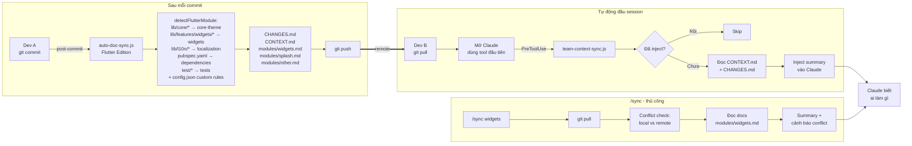

# Auto-Doc-Sync — Luồng hoạt động (Flutter)



## Cấu trúc file trong Flutter project

```
codebase/flutter/
├── .claude/hooks/
│   ├── auto-doc-sync/          # PostToolUse — GHI docs sau commit
│   │   ├── auto-doc-sync.js    # Flutter module detection + config.json
│   │   ├── deduplicate-changes.js
│   │   └── deduplicate-module-docs.js
│   └── team-context-sync/      # PreToolUse — ĐỌC docs đầu session
│       └── team-context-sync.js
├── CHANGES.md                  # Auto-generated changelog
└── docs/
    ├── CONTEXT.md              # Auto-generated AI context
    └── modules/
        ├── widgets.md
        ├── splash.md
        └── other.md
```

## Flutter module detection

| File path | Module |
|-----------|--------|
| `lib/core/theme/*` | `core-theme` |
| `lib/core/utils/*` | `core-utils` |
| `lib/features/presentation/auth_module/*` | `auth` |
| `lib/features/widgets/*` | `widgets` |
| `lib/l10n/*` | `localization` |
| `pubspec.yaml` | `dependencies` |
| `test/*` | `tests` |
| Custom rules từ `config.json` | Ưu tiên check trước |

## settings.json cần có

```json
{
  "hooks": {
    "PreToolUse": [
      {
        "matcher": "Bash|Write|Edit",
        "hooks": [{
          "type": "command",
          "command": "node \"$CLAUDE_PROJECT_DIR\"/.claude/hooks/team-context-sync/team-context-sync.js"
        }]
      }
    ],
    "PostToolUse": [
      {
        "matcher": "Bash",
        "hooks": [{
          "type": "command",
          "command": "node \"$CLAUDE_PROJECT_DIR\"/.claude/hooks/auto-doc-sync/auto-doc-sync.js"
        }]
      }
    ]
  }
}
```
