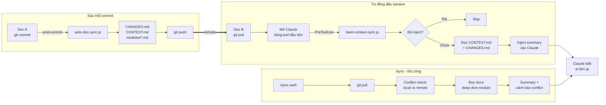

# Auto-Doc-Sync — Luồng hoạt động

## 3 luồng

1. **Ghi** — mỗi commit tự cập nhật docs, push lên remote
2. **Đọc tự động** — Claude session mới, tool đầu tiên trigger hook, inject team context 1 lần
3. **/sync thủ công** — pull + conflict check + deep dive module cụ thể
