# DB Context Sync - Sơ Đồ Hoạt Động

## 🏗️ Kiến Trúc Tổng Quan

```mermaid
graph TB
    subgraph "User Environment"
        User[👤 Developer]
        ClaudeDesktop[🖥️ Claude Desktop]
        Project[📁 Project<br/>prisma/schema.prisma]
    end

    subgraph "MCP Server"
        MCPServer[🔌 DB Context Sync MCP]
        Tools[🛠️ Tools<br/>scan_database<br/>update_schema<br/>compare_schemas]
        Resources[📚 Resources<br/>database-schema.md<br/>database-context.md]
        Prompts[🤖 Prompts<br/>database-analysis<br/>migration-planning<br/>query-optimization]
    end

    subgraph "Processing Engine"
        Parser[📖 Schema Parser]
        MermaidGen[🎨 Mermaid Generator]
        ContextGen[📝 Context Generator]
        Analyzer[🔍 Schema Analyzer]
    end

    subgraph "Output Files"
        SchemaDoc[📄 docs/database-schema.md<br/>Mermaid ERD + Tables]
        ContextDoc[📄 docs/database-context.md<br/>Metadata + Recommendations]
        PreviousSchema[📄 .database-schema.previous.md<br/>Version History]
    end

    User -->|Requests| ClaudeDesktop
    ClaudeDesktop <-->|MCP Protocol| MCPServer

    MCPServer --> Tools
    MCPServer --> Resources
    MCPServer --> Prompts

    Tools -->|Scan| Project
    Project -->|Schema Content| Parser

    Parser -->|Parsed Data| MermaidGen
    Parser -->|Parsed Data| ContextGen
    Parser -->|Parsed Data| Analyzer

    MermaidGen --> SchemaDoc
    ContextGen --> ContextDoc
    Analyzer --> ContextDoc

    SchemaDoc -->|Backup| PreviousSchema

    Resources -->|Read| SchemaDoc
    Resources -->|Read| ContextDoc

    Prompts -->|Analyze| SchemaDoc
    Prompts -->|Analyze| ContextDoc

    SchemaDoc -.->|AI Context| ClaudeDesktop
    ContextDoc -.->|AI Context| ClaudeDesktop
```



---

## 🔄 Workflow Chi Tiết

### 1. Scan Database Flow


### 2. Database Analysis Flow

```mermaid
sequenceDiagram
    participant User
    participant Claude
    participant MCP as MCP Server
    participant Analyzer
    participant Docs as Docs Files

    User->>Claude: "Use prompt database-analysis"
    Claude->>MCP: prompts/get: database-analysis
    MCP->>Docs: Read database-schema.md
    Docs-->>MCP: Schema content
    MCP->>Docs: Read database-context.md
    Docs-->>MCP: Context content

    MCP->>Analyzer: Analyze structure
    Analyzer->>Analyzer: Check indexes
    Analyzer->>Analyzer: Check relationships
    Analyzer->>Analyzer: Check normalization
    Analyzer-->>MCP: Analysis + Recommendations

    MCP-->>Claude: Prompt with analysis
    Claude->>Claude: Generate Vietnamese response
    Claude-->>User: "✅ Điểm tốt...<br/>⚠️ Vấn đề...<br/>🔧 Recommendations..."
```



### 3. Migration Planning Flow


---

## 📊 Data Flow Architecture

```mermaid
flowchart TD
    subgraph Input
        A[Prisma Schema<br/>prisma/schema.prisma]
        B[Connection String<br/>MySQL/PostgreSQL]
    end

    subgraph Parser["Schema Parser"]
        C[Model Extraction]
        D[Field Parsing]
        E[Relationship Detection]
        F[Constraint Analysis]
    end

    subgraph DataStructure["Internal Data Structure"]
        G[Tables Array<br/>{name, fields}]
        H[Relationships Array<br/>{from, to, type}]
        I[Metadata<br/>{stats, indexes}]
    end

    subgraph Generators["Output Generators"]
        J[Mermaid ERD Generator]
        K[Context Doc Generator]
        L[Analysis Engine]
    end

    subgraph Output["Documentation Files"]
        M[database-schema.md<br/>Visual ERD + Tables]
        N[database-context.md<br/>AI-readable context]
        O[.previous.md<br/>Version history]
    end

    A --> C
    B --> C
    C --> D
    D --> E
    E --> F

    F --> G
    F --> H
    F --> I

    G --> J
    G --> K
    H --> J
    H --> K
    I --> K

    G --> L
    H --> L
    I --> L

    J --> M
    K --> N
    M --> O

    L -.->|Recommendations| N
```

---

## 🔍 Schema Parsing Deep Dive

```mermaid
graph LR
    subgraph "Prisma Schema"
        Schema["model User {<br/>  id Int @id<br/>  email String @unique<br/>  posts Post[]<br/>}"]
    end

    subgraph "Regex Parsing"
        R1[/model\s+(\w+)\s*{/]
        R2[/(\w+)\s+(\w+)(\?|\[\])?/]
        R3[/@relation\(.*?\)/]
    end

    subgraph "Extracted Data"
        Model[Table: User]
        Fields["Fields:<br/>- id: Int, PK<br/>- email: String, UNIQUE<br/>- posts: Post[], FK"]
        Rels["Relationships:<br/>User → Post (one-to-many)"]
    end

    subgraph "Validation"
        V1[Check PK exists]
        V2[Validate FK references]
        V3[Check circular deps]
    end

    Schema --> R1
    R1 --> Model

    Schema --> R2
    R2 --> Fields

    Schema --> R3
    R3 --> Rels

    Model --> V1
    Rels --> V2
    Rels --> V3
```

---

## 🎨 Mermaid Generation Process

```mermaid
flowchart TB
    subgraph Input["Input Data"]
        T[Tables:<br/>[{name, fields}]]
        R[Relationships:<br/>[{from, to, type}]]
    end

    subgraph Processing["ERD Generation"]
        H1[Generate Header]
        H2[Generate erDiagram block]

        Loop1[For each table]
        Loop2[For each field]
        Loop3[For each relationship]

        Format1[Format field types]
        Format2[Add constraints<br/>PK, FK, UNIQUE]
        Format3[Format relationship<br/>||--o{, }o--||]
    end

    subgraph Output["Mermaid Syntax"]
        Mermaid["```mermaid<br/>erDiagram<br/>  User {<br/>    Int id PK<br/>  }<br/>  User ||--o{ Post<br/>```"]
    end

    T --> Loop1
    Loop1 --> Loop2
    Loop2 --> Format1
    Format1 --> Format2

    R --> Loop3
    Loop3 --> Format3

    H1 --> H2
    H2 --> Format2
    Format2 --> Format3
    Format3 --> Mermaid
```

---

## 🤖 AI Prompt Generation

```mermaid
graph TD
    subgraph "Trigger"
        U[User: "Use prompt database-analysis"]
    end

    subgraph "Context Gathering"
        R1[Read database-schema.md]
        R2[Read database-context.md]
        R3[Read table statistics]
    end

    subgraph "Analysis"
        A1[Parse table structure]
        A2[Check indexes]
        A3[Validate relationships]
        A4[Check normalization]
        A5[Identify N+1 risks]
    end

    subgraph "Prompt Construction"
        P1[Add schema markdown]
        P2[Add context info]
        P3[Add analysis tasks]
        P4[Set output language<br/>Vietnamese]
    end

    subgraph "Claude Response"
        C1[✅ Điểm tốt]
        C2[⚠️ Vấn đề]
        C3[🔧 Recommendations]
    end

    U --> R1
    U --> R2
    U --> R3

    R1 --> A1
    R2 --> A2
    R3 --> A3
    A1 --> A4
    A2 --> A5

    A3 --> P1
    A4 --> P2
    A5 --> P3
    P3 --> P4

    P4 --> C1
    P4 --> C2
    P4 --> C3
```

---

## 📈 State Diagram


---

## 🔄 Real-Time Update Flow

```mermaid
sequenceDiagram
    participant Dev as Developer
    participant Prisma as prisma/schema.prisma
    participant MCP as MCP Server
    participant Docs as Documentation

    Note over Dev: Day 1: Initial Setup
    Dev->>Prisma: Create User, Post models
    Dev->>MCP: scan_database
    MCP->>Docs: Generate v1 docs

    Note over Dev: Day 2: Add Comments
    Dev->>Prisma: Add Comment model
    Dev->>MCP: update_schema
    MCP->>Docs: Backup v1 → .previous.md
    MCP->>Docs: Generate v2 docs

    Note over Dev: Compare versions
    Dev->>MCP: compare_schemas
    MCP->>Docs: Read v1 and v2
    MCP-->>Dev: "Added: Comment table<br/>New relationships: 2"

    Note over Dev: Analysis
    Dev->>MCP: prompt database-analysis
    MCP->>Docs: Read v2 docs
    MCP-->>Dev: "✅ Good: proper indexes<br/>⚠️ Issue: missing cascade delete"
```



---

## 💾 File Structure Evolution


---

## 🎯 Use Case: Adding New Feature

```mermaid
flowchart TD
    Start([Developer needs Comments feature])

    Ask[Ask Claude:<br/>"I need to add comments"]

    Check{Claude checks<br/>database context}

    Read1[Read database-schema.md]
    Read2[Read database-context.md]

    Analyze[Analyze current structure:<br/>- User table exists<br/>- Post table exists<br/>- Relationships defined]

    Design[Design Comment model:<br/>- id, content, authorId, postId<br/>- Relationships to User, Post]

    Generate[Generate Prisma schema:<br/>```prisma<br/>model Comment {...}```]

    Plan[Create migration plan:<br/>1. Add model<br/>2. Add relationships<br/>3. Run migration<br/>4. Update docs]

    Implement[Developer implements]

    Update[Run: update_schema]

    Verify[Verify with:<br/>compare_schemas]

    Done([✅ Feature Complete])

    Start --> Ask
    Ask --> Check
    Check -->|Yes| Read1
    Read1 --> Read2
    Read2 --> Analyze
    Analyze --> Design
    Design --> Generate
    Generate --> Plan
    Plan --> Implement
    Implement --> Update
    Update --> Verify
    Verify --> Done
```

---

## 🚀 Performance Optimization


---

## 📊 Component Interaction


---

**Tất cả workflows được optimize cho AI context và developer productivity!** 🎯
