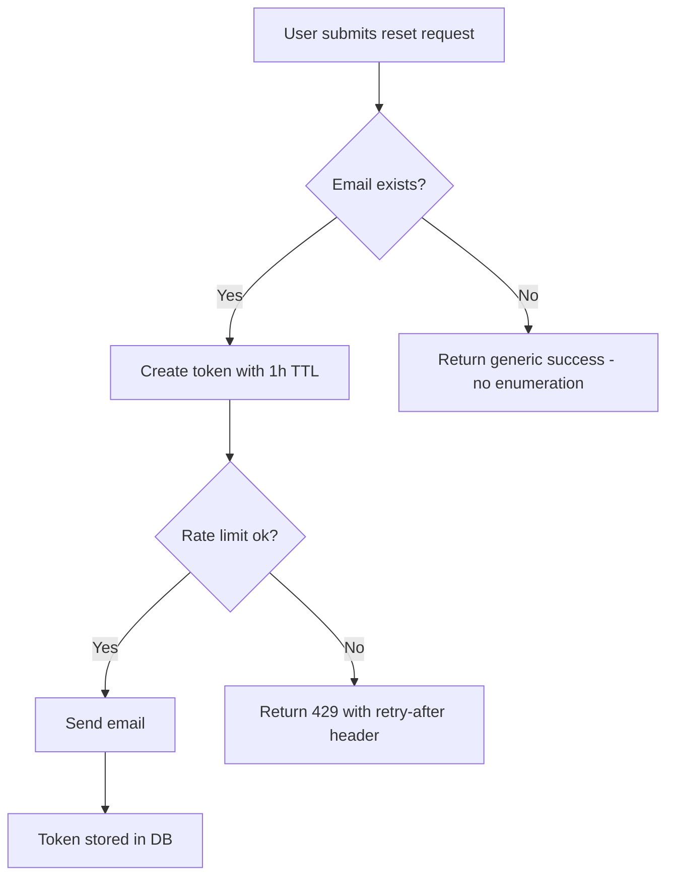
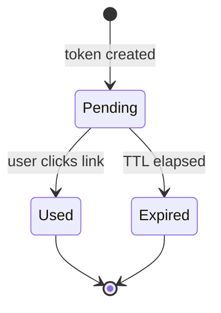
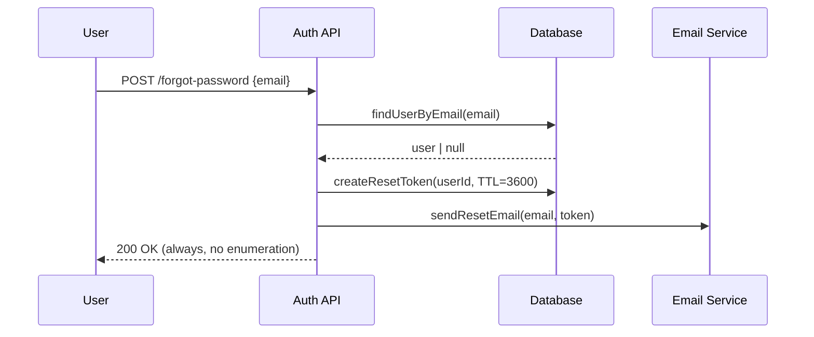
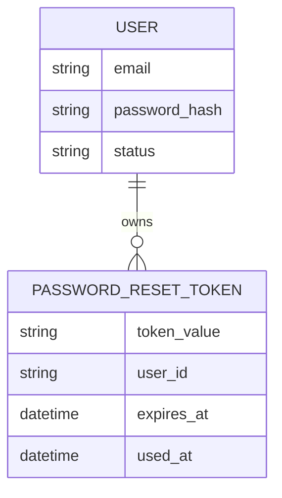

# GUIDE — Business Analyst Team (Technology-Focused)

> Hướng dẫn chi tiết từng agent và chức năng thuần tuý của team BA kỹ thuật.
> Team này KHÔNG làm kinh doanh — chỉ phân tích kỹ thuật.

---

## Team này làm gì?

**Business Analyst Team** phân tích và định nghĩa yêu cầu kỹ thuật trước khi engineering bắt đầu làm việc. Team trả lời các câu hỏi:

- Hệ thống cần làm **gì** và **trong điều kiện nào**?
- Data nào cần tồn tại và flow như thế nào?
- Process nào cần được model?
- Tích hợp với hệ thống ngoài nào và theo contract gì?
- Use case nào cần test và theo criteria gì?

**Không phải nhiệm vụ của team này:**
- Quyết định kiến trúc kỹ thuật (backend/frontend/database team làm)
- Viết code
- Phân tích doanh thu, KPIs kinh doanh, thị trường

---

## Pipeline tổng thể

```
[Input: yêu cầu tính năng / feature request / bug context]
        |
        v
 requirements-analyst      <-- Bước 1: luôn chạy đầu tiên
        |
        |-- system-analyst (chỉ khi có hệ thống sẵn)
        |
        |------+------------------+-------------------+
        |      v                  v                   v
        | process-analyst   data-analyst    integration-analyst
        | (workflow/state)  (entities/flow) (APIs/integrations)
        |      |                  |                   |
        |      +------------------+-------------------+
        |                    |
        |              (song song với bất kỳ bước nào)
        |             tech-researcher
        |
        v
  use-case-modeler          <-- Sau khi process + data xong
        |
        v
     spec-writer             <-- Cuối cùng: tổng hợp toàn bộ
        |
        v
    docs-manager             <-- Lưu trữ và đồng bộ docs
```

---

## Agents — Chi tiết từng chức năng thuần tuý

---

### requirements-analyst
**Màu:** Cam | **Model:** Sonnet

#### Chức năng thuần tuý
Biến đầu vào mơ hồ thành tài liệu yêu cầu kỹ thuật có cấu trúc. Đây là **bước số 1 bắt buộc** — không agent nào khác nên chạy trước nó.

#### Input
- Mô tả vague từ người dùng: "Cần tính năng reset password"
- Feature request từ stakeholders
- Bug report cần phân tích scope

#### Output — Technical Requirements Document (TR-XXX)
```json
{
  "requirementId": "TR-001",
  "actors": [
    { "name": "RegisteredUser", "role": "initiates reset", "permissions": ["read own account"] }
  ],
  "functionalRequirements": [
    {
      "id": "FR-001",
      "priority": "Must Have",
      "description": "The system SHALL send a password reset email when a registered user requests it",
      "trigger": "User submits email on /forgot-password",
      "preconditions": ["Email exists in system"],
      "postconditions": ["Reset token created with 1h TTL", "Email sent"],
      "errorConditions": ["Email not found → generic message (no enumeration)", "Rate limit exceeded → 429"]
    }
  ],
  "nonFunctionalRequirements": [
    {
      "id": "NFR-001",
      "category": "Security",
      "requirement": "Reset tokens must be single-use and expire after 1 hour",
      "measurableTarget": "Token invalidated after first use OR after 3600 seconds",
      "priority": "Must Have"
    }
  ]
}
```

#### Không làm gì
- Không đề xuất framework, database, cloud
- Không viết code
- Không thiết kế UI
- Không phân tích doanh thu hay KPIs kinh doanh

#### Tools: Read, Glob, Grep, WebSearch, Write, Task tools

---

### system-analyst
**Màu:** Xanh lá | **Model:** Opus (phức tạp nhất)

#### Chức năng thuần tuý
Đọc và phân tích hệ thống đã có. **Read-only — tuyệt đối không sửa code**.

#### Khi nào dùng
Chỉ khi task liên quan đến hệ thống hiện có: migration, refactoring, tích hợp với legacy system.

#### Input
- Đường dẫn codebase
- Yêu cầu phân tích từ requirements-analyst

#### Output — System Intelligence Report (9 sections)
1. **Executive Summary** — tech stack, health assessment (Critical/Poor/Fair/Good/Excellent), top findings
2. **Architecture Overview** — architectural style, component diagram (Mermaid), communication patterns
3. **Module Breakdown** — từng module: purpose, location, public interface, dependencies, complexity
4. **Data Model Overview** — entity catalogue, relationships, migration history
5. **Dependency Graph** — internal + external deps, circular deps, vulnerable packages
6. **Tech Debt & Risk Analysis** — TD-001, TD-002... mỗi item: category, severity, location, impact
7. **Documentation vs Code Gap** — docs outdated ở đâu, undocumented paths
8. **Refactoring Risk Level** — coupling analysis, test coverage impact
9. **Migration Feasibility** — blockers, complexity, recommended strategy

#### Không làm gì
- Không sửa, xóa, tạo file code
- Không đề xuất refactoring trong code — chỉ ghi vào report
- Không thiết kế giải pháp mới

#### Tools: Read, Glob, Grep, Bash, WebSearch, Write, Task tools

---

### process-analyst
**Màu:** Vàng | **Model:** Sonnet

#### Chức năng thuần tuý
Biến requirements thành process models bằng Mermaid diagrams. Tìm và document MỌI nhánh — bao gồm tất cả error paths, timeout, cancellation.

#### Input
- TR-XXX từ requirements-analyst
- System Intelligence Report (nếu có)

#### Output — Process Documents (`./docs/processes/`)

**1. Process Flow Diagram**


**2. State Machine** — cho các entities có states


**3. Sequence Diagram** — cho multi-system interactions


**4. Edge Case Catalogue**
```
EC-001: User clicks expired token → 400 "Link expired. Request a new one."
EC-002: User clicks already-used token → 400 "Link already used."
EC-003: Email service down → Token created, 202 Accepted, retry queued
EC-004: Concurrent reset requests → Only latest token valid, previous invalidated
```

#### Không làm gì
- Không viết code
- Không thiết kế database schema
- Không quyết định tech stack

#### Tools: Read, Glob, Grep, Write, Task tools

---

### data-analyst
**Màu:** Xanh dương | **Model:** Sonnet

#### Chức năng thuần tuý
Định nghĩa logical data model — data entities, attributes, relationships, flows, lifecycle. **Không thiết kế physical schema** (không CREATE TABLE, không column types).

#### Input
- TR-XXX từ requirements-analyst
- Process models từ process-analyst

#### Output — Data Specification (`./docs/data/`)

**1. Entity Catalogue**
```
Entity: PasswordResetToken
Description: Temporary token for password reset verification
Lifecycle: Created on reset request → Used on successful reset → Expired after 1 hour
Sensitivity: [CONFIDENTIAL]
Volume estimate: Low (~100/day, 1 active per user max)
Relationships:
  - Belongs to one User

Attributes:
  - token_value: Cryptographically random string | required | min 32 chars, URL-safe
  - user_id: Reference to User | required |
  - created_at: Timestamp | required |
  - expires_at: Timestamp | required | must be > created_at
  - used_at: Timestamp | optional | null = unused
  - is_valid: Computed | true if used_at is null AND expires_at > now()
```

**2. Entity Relationship Diagram**


**3. Data Validation Rules**
```
VR-001: PasswordResetToken.expires_at — must be exactly now() + 3600 seconds on creation
VR-002: PasswordResetToken — max 1 active token per user (is_valid = true)
VR-003: User.email — must be verified before reset can be initiated
```

**4. Data Sensitivity Map**
| Entity | Attribute | Sensitivity | Reason |
|--------|-----------|-------------|--------|
| User | email | Confidential | PII |
| User | password_hash | Restricted | Credentials |
| PasswordResetToken | token_value | Restricted | Security credential |

#### Không làm gì
- Không thiết kế database columns (types, indexes)
- Không viết SQL hay ORM code
- Không chọn database engine

#### Tools: Read, Glob, Grep, Write, Task tools

---

### integration-analyst
**Màu:** Cyan | **Model:** Sonnet

#### Chức năng thuần tuý
Map và define mọi điểm tích hợp với hệ thống ngoài hoặc internal services. Không implement — chỉ specify requirements cho từng integration.

#### Input
- TR-XXX từ requirements-analyst
- Thông tin về existing integrations từ system-analyst (nếu có)

#### Output — Integration Catalogue (`./docs/integrations/`)

```
Integration ID: INT-001
Name: Email Service (SendGrid / SES / SMTP)
Type: Asynchronous (fire-and-forget)
Direction: Outbound

Purpose: Send password reset email with tokenized link

Outbound Data:
  - recipient_email: User's email [CONFIDENTIAL]
  - reset_link: URL with token embedded [CONFIDENTIAL]
  - expiry_time: Human-readable "expires in 1 hour"

Authentication:
  - Method: API Key
  - Key rotation: Every 90 days

Error Scenarios:
  - INT-001-E1: Delivery failure → Log error, return 202 (email queued), retry 3x with backoff
  - INT-001-E2: Invalid email format → Should be caught by validation before this step
  - INT-001-E3: Rate limit → Queue for retry, notify ops if queue > 1000

SLA Required: Delivery within 30 seconds, 99.5% uptime
Criticality: High — feature non-functional if down, but system otherwise OK
Fallback: Queue email for retry when service recovers

Data Transformation:
  - token (raw) → reset_link (formatted as: https://app.com/reset?token={value})
```

#### Không làm gì
- Không viết code gọi API
- Không generate OpenAPI/Swagger specs
- Không chọn thư viện SDK

#### Tools: Read, Glob, Grep, WebSearch, WebFetch, Write, Task tools

---

### use-case-modeler
**Màu:** Tím | **Model:** Sonnet

#### Chức năng thuần tuý
Định nghĩa đầy đủ use cases với MỌI flows — không chỉ happy path. Viết acceptance criteria Given/When/Then **testable được ngay** không cần giải thích thêm.

#### Input
- TR-XXX từ requirements-analyst
- Process models từ process-analyst
- Data spec từ data-analyst

#### Output — Use Case Catalogue (`./docs/use-cases/`)

```
Use Case ID: UC-001
Title: Request Password Reset
Primary Actor: RegisteredUser
Secondary Actors: Email Service

Preconditions:
  - User has a registered account with verified email
  - User is NOT currently logged in

Postconditions (Success):
  - Reset token created with 1h TTL and stored
  - Reset email delivered to user's inbox
  - Previous reset tokens for this user invalidated

Postconditions (Failure):
  - No token created
  - No information revealed about account existence

Main Success Scenario:
  1. User navigates to /forgot-password
  2. User enters email address and submits form
  3. System validates email format
  4. System looks up email in database
  5. System creates single-use reset token (TTL: 1 hour)
  6. System invalidates any previously active reset tokens for this user
  7. System queues reset email to email service
  8. System returns generic success message: "If that email exists, you'll receive a link"

Alternative Flow A1 — Email not found (at step 4):
  A1.1. System silently skips token creation (no enumeration)
  A1.2. System returns identical generic success message as step 8
  A1.3. No email is sent
  End.

Alternative Flow A2 — Rate limit reached (at step 5):
  A2.1. System returns 429 with Retry-After header
  A2.2. No token created
  End.

Exception Flow E1 — Email service unavailable (at step 7):
  E1.1. System logs delivery failure
  E1.2. System queues email for retry (max 3 attempts, exponential backoff)
  E1.3. System returns 202 Accepted to user (async delivery)
  End.
```

**Acceptance Criteria:**
```
AC-001.1: Success — token created
  Given: User with email "user@example.com" exists and is verified
  When: POST /forgot-password with body {email: "user@example.com"}
  Then: Response is 200 OK
  And: A reset token is created in DB with expires_at = now() + 3600s
  And: Any previous active tokens for this user are invalidated
  And: Email is queued for delivery

AC-001.2: Unknown email — no enumeration
  Given: Email "unknown@example.com" does NOT exist in system
  When: POST /forgot-password with body {email: "unknown@example.com"}
  Then: Response is 200 OK (identical to success response)
  And: No token is created
  And: No email is sent
  And: Response body is identical to AC-001.1 response

AC-001.3: Expired token unusable
  Given: A reset token exists with expires_at in the past
  When: User submits POST /reset-password with that token
  Then: Response is 400 Bad Request
  And: Error message: "This link has expired. Request a new one."
  And: Token is NOT used (used_at remains null)
```

#### Không làm gì
- Không viết test code (Playwright, Jest...)
- Không thiết kế API endpoints
- Không viết code implement

#### Tools: Read, Glob, Grep, Write, Task tools

---

### spec-writer
**Màu:** Hồng | **Model:** Sonnet

#### Chức năng thuần tuý
**Bước cuối cùng trong pipeline phân tích.** Đọc TẤT CẢ output từ các agents trước và tổng hợp thành một tài liệu FRS hoàn chỉnh duy nhất. Không thêm requirement mới — chỉ tổng hợp, làm rõ, và phát hiện conflicts/gaps.

#### Input
- TR-XXX (requirements-analyst)
- System Intelligence Report (system-analyst, nếu có)
- Process models (process-analyst)
- Data specification (data-analyst)
- Integration catalogue (integration-analyst)
- Use case catalogue (use-case-modeler)
- Research findings (tech-researcher, nếu có)

#### Output — Functional Requirements Specification
`./docs/specs/FRS-[feature]-v1.0.md`

**Cấu trúc FRS:**
1. Scope & Objectives
2. System Context (actors, boundaries, context diagram)
3. Functional Requirements — mỗi FR với acceptance criteria
4. Non-Functional Requirements — mỗi NFR với measurable target
5. Process Flows — embed Mermaid diagrams
6. Data Specification — entity catalogue + validation rules
7. Integration Requirements — mỗi integration với contract
8. Use Case Summary — traceability table
9. Constraints & Assumptions — gaps, conflicts, open questions
10. **Traceability Matrix** — link mọi requirement về source document

**Traceability matrix mẫu:**
| FR ID | Source | Use Case | Integration | Priority |
|-------|--------|----------|-------------|---------|
| FR-001 | TR-001 | UC-001 | INT-001 | Must Have |
| FR-002 | TR-001 | UC-002 | — | Should Have |

**Flags quan trọng:**
- `[GAP]` — logic rõ ràng nhưng không có trong source docs
- `[CONFLICT]` — mâu thuẫn giữa 2 source documents
- `[OPEN QUESTION]` — câu hỏi chưa được resolve

#### Không làm gì
- Không thêm requirements mới không có trong input docs
- Không quyết định tech stack
- Không thay đổi kết quả analysis của agents khác

#### Tools: Read, Glob, Grep, Write, Task tools

---

### tech-researcher
**Màu:** Cyan | **Model:** Sonnet

#### Chức năng thuần tuý
Nghiên cứu kỹ thuật có nguồn rõ ràng. Chạy **song song** với bất kỳ agent nào cần thông tin bên ngoài. Không tạo requirements — chỉ cung cấp facts.

#### Ví dụ tasks phù hợp
- "Stripe webhooks hỗ trợ retry bao nhiêu lần?"
- "OAuth2 PKCE flow hoạt động như thế nào cho mobile?"
- "Giới hạn message size của AWS SQS là bao nhiêu?"
- "WCAG 2.1 AA contrast ratio yêu cầu chính xác là bao nhiêu?"

#### Output — Research Report (`./docs/research/`)
```
Finding 1: Stripe retries failed webhook deliveries up to 72 hours,
           with exponential backoff (immediately, then 5min, 30min, 2h, 5h...)
Source: https://stripe.com/docs/webhooks/best-practices (Official Docs)
Reliability: Official

Finding 2: Webhook events must be acknowledged within 30 seconds (HTTP 2xx)
Source: https://stripe.com/docs/webhooks (Official Docs)
Reliability: Official
```

#### Không làm gì
- Không viết code
- Không tạo requirements hay specs
- Không đưa ra architecture decisions

#### Tools: WebSearch, WebFetch, Read, Glob, Write, Task tools

---

### docs-manager
**Màu:** Xanh dương | **Model:** Sonnet

#### Chức năng thuần tuý
Lưu trữ, tổ chức, và đồng bộ tất cả tài liệu trong `./docs/`. Chạy sau mỗi deliverable.

#### Cấu trúc ./docs/ do docs-manager quản lý
```
./docs/
├── requirements/       # TR-XXX từ requirements-analyst
├── system-analysis/    # Reports từ system-analyst
├── processes/          # Diagrams từ process-analyst
├── data/               # Data specs từ data-analyst
├── integrations/       # Catalogues từ integration-analyst
├── use-cases/          # UC catalogues từ use-case-modeler
├── specs/              # FRS từ spec-writer
├── research/           # Findings từ tech-researcher
└── changelog.md        # Lịch sử thay đổi
```

---

## Commands

### Gọi toàn bộ pipeline
```
/lead
```

### Gọi agent cụ thể
```
/requirements-analyst    -- Phân tích và structure requirements
/system-analyst          -- Phân tích codebase hiện có
/process-analyst         -- Model workflows và state machines
/data-analyst            -- Định nghĩa data entities và flows
/integration-analyst     -- Map API và integration requirements
/use-case-modeler        -- Định nghĩa use cases và acceptance criteria
/spec-writer             -- Tổng hợp thành FRS document
/tech-researcher         -- Nghiên cứu kỹ thuật có nguồn
/docs-manager            -- Cập nhật documentation
```

### Code — Thực thi pipeline tuần tự
```
/code
```

### Code Parallel — Chạy process + data + integration song song
```
/code:parallel
```
**Khi nào dùng:**
- Sau khi requirements-analyst xong → spawn process-analyst + data-analyst + integration-analyst cùng lúc
- tech-researcher chạy song song với bất kỳ bước nào

**Ví dụ:**
```
requirements-analyst hoàn thành TR-001
→ /code:parallel spawn 4 agents cùng lúc:
  - process-analyst (đọc TR-001, tạo process models)
  - data-analyst (đọc TR-001, tạo data spec)
  - integration-analyst (đọc TR-001, map integrations)
  - tech-researcher (nghiên cứu tech liên quan)
→ Tất cả xong → use-case-modeler (đọc tất cả outputs)
→ spec-writer (tổng hợp)
```

---

## Ví dụ prompts thực tế

**Feature mới hoàn toàn:**
```
/lead

Phân tích yêu cầu kỹ thuật cho tính năng:
"Người dùng có thể đặt hàng nhiều sản phẩm,
thanh toán qua Stripe, nhận email xác nhận,
và theo dõi trạng thái đơn hàng realtime."

Hệ thống: Node.js backend, PostgreSQL, đang có module User và Product sẵn.
```

**Chỉ phân tích hệ thống cũ:**
```
/system-analyst

Phân tích codebase tại /path/to/project
Tôi cần hiểu architecture trước khi thêm microservices.
```

**Parallel analysis cho feature lớn:**
```
/lead

Requirements đã xong tại ./docs/requirements/TR-005.md
Chạy parallel:
- process-analyst: model checkout workflow
- data-analyst: define Order + Payment entities
- integration-analyst: map Stripe + SendGrid integrations
- tech-researcher: research Stripe webhook reliability SLAs
Sau đó use-case-modeler → spec-writer.
```

---

## Output artifacts hoàn chỉnh sau 1 feature

| File | Agent | Mô tả |
|------|-------|-------|
| `./docs/requirements/TR-001.md` | requirements-analyst | Technical requirements |
| `./docs/system-analysis/report-[date].md` | system-analyst | Current system state |
| `./docs/processes/checkout-flow.md` | process-analyst | Flowcharts + state machines |
| `./docs/data/order-data-spec.md` | data-analyst | Entity catalogue + DFD |
| `./docs/integrations/payment-integrations.md` | integration-analyst | Stripe + email contracts |
| `./docs/use-cases/checkout-uc.md` | use-case-modeler | Use cases + acceptance criteria |
| `./docs/research/stripe-webhooks.md` | tech-researcher | Research findings |
| `./docs/specs/FRS-checkout-v1.0.md` | spec-writer | Final FRS document |

---

## Security Policy áp dụng

- Không PII trong requirements documents — dùng generic roles ("RegisteredUser", "AdminUser")
- Data sensitivity phải được classify trong Data Specification
- Mọi tài liệu phải có label: `[PUBLIC]` / `[INTERNAL]` / `[CONFIDENTIAL]`
- Mặc định: `[INTERNAL]` cho requirements, `[CONFIDENTIAL]` cho system analysis
